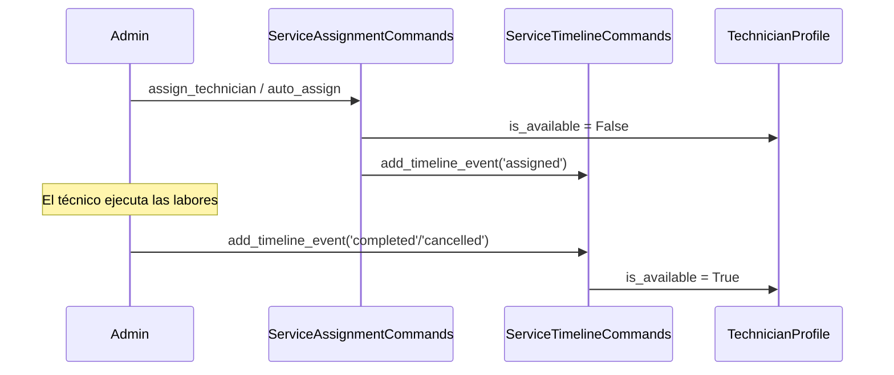

# Arquitectura Completa: Módulo Technical Services (Servicios Técnicos)

> **Auditado:** 2026-07-09 — sincronizado contra código fuente y 25 migraciones aplicadas.
> Actualizado con: rediseño del checkout en modal (§13.4), el módulo **Operaciones de Servicios
> Técnicos** / `ServiceOperation` (§18) y la centralización de la asignación de técnicos en
> `/panel/servicios/operaciones` (§17.4). Ver también §17 (Marketplace de Contratistas +
> Asignación de Técnicos, 2026-07-05).
> **2026-07-16:** agregado el **Sistema de Paquetes de Servicio** (§20) — extensión aditiva
> (`ServicePackage`/`PackageIncludedItem`/`PackageAdditionalCost`, mig. 0027) que no modifica
> ningún modelo, endpoint ni contrato previo.
> **2026-07-17 — re-auditado y sincronizado completo, 30 migraciones aplicadas (actualizado a
> 31 el 2026-07-23 tras agregarse la mig. 0031 tras esta nota — ver §16 C8):** este doc
> tenía varias secciones desactualizadas encontradas por auditoría (no reportadas por el
> usuario, ver §16 C7). Correcciones: (1) el motor de reglas de costo `ServiceCostRule`/
> `ServiceCostAssignment`/`ServicePricingCalculator` (`services/pricing.py`, mig. 0015) no
> estaba documentado en absoluto pese a ser un paso OBLIGATORIO de toda cotización desde
> hace tiempo — ver nuevo §5.2bis; (2) §19.4 afirmaba que la Fase 7 (auto-asignación real
> vía el motor) era trabajo futuro pendiente de aprobación — **ya está en producción**,
> wireada en `ServiceCommands.confirm_slot_on_payment` y expuesta en
> `POST /service-operations/{uuid}/auto-assign/`, con su propio test
> (`AutoAssignViaEngineTestCase`); (3) §3/§11 describían `ModelViewSet`s admin-escribibles
> bajo `/api/v1/services/...` que no existen — los 4 ViewSets de catálogo son
> **ReadOnlyModelViewSet**, el CRUD real vive en `dashboard/api/` (BFF admin), fuera de esta
> app; (4) el Resumen Ejecutivo/§1 seguían describiendo Inventory/`StockRecord` como el
> mecanismo vigente de disponibilidad — es legado vestigial, ver nota abajo; (5) §5.1
> describía un chequeo de `quantity` contra stock en `_check_service_availability` que no
> existe (la función real solo valida `is_active`); (6) §7 le faltaba la clave
> `active_bookings` del dict real; (7) nuevo `api/internal_ai.py` (API interna solo para el
> AI Core) no estaba documentado — ver nota en §1. Bug real corregido de paso:
> `ServiceRequestAdditionalCost.__str__` referenciaba `self.name` (no existe en el modelo,
> el campo real es `name_snapshot`) — crasheaba con `AttributeError` en cualquier `str()` de
> una instancia. Además, los templates de notificación `service_request_created`/
> `service_status_updated` (usados desde siempre por `ServiceCommands`) nunca tuvieron
> migración de seed (a diferencia de `service_payment_confirmed`/mig. 0022 y los 5 de
> operaciones/mig. 0024) — cerrado con `0030_seed_service_request_status_templates.py`.
> **2026-07-23 — auditoría de verificación puntual (sin cambios de código):** este doc ya
> estaba en muy buen estado (auto-correcciones hasta 2026-07-22, §16 C7-C9) — se encontraron y
> corrigieron 4 discrepancias menores, no una re-auditoría completa: (1) conteo de migraciones
> inconsistente ("30" en este encabezado y en el diagrama del §1, "31" en la Conclusión) —
> unificado a 31, que es el real; (2) **`ServiceBooking`** (mig. 0017, uno de los 3 sistemas
> paralelos de disponibilidad del §14.1, contabilizado en `active_bookings` del §7) nunca tuvo
> un bloque de modelo propio en §2 pese a mencionarse extensamente en prosa — agregado §2.10bis;
> (3) las rutas `GET .../services/{uuid}/packages/` y `POST .../quote-package/` (documentadas
> en detalle en §20.4 desde 2026-07-16) faltaban en el bloque de rutas consolidado del §11; (4)
> **hallazgo real más importante:** este documento afirmaba en al menos 4 lugares (§14, tabla
> §17.1, §17.2, §17.3 punto 4) que `TechnicianAssignmentBoard.vue`
> (`/panel/servicios/asignacion-tecnicos`) fue retirada del sidebar el 2026-07-09 — verificado
> contra `frontend/src/components/layout/Sidebar.vue:191` que **sigue apareciendo hoy**, dentro
> del grupo "Operaciones". No se pudo determinar cuándo dejó de ser cierto (repo con un solo
> commit, sin historial previo) — corregido en las 4 ubicaciones.

## Resumen Ejecutivo

El módulo **Technical Services** implementa un catálogo de servicios técnicos e instalación profesional en la plataforma e-commerce. Utiliza un **LaborCostCalculator** basado en SMLV colombiano para calcular dinámicamente el costo de mano de obra con soporte para múltiples estrategias de cobro (HOURLY, DAILY, FIXED), seguido SIEMPRE por el motor de reglas de costo `ServicePricingCalculator` (§5.2bis) antes de aplicar descuento/IVA. El cálculo final incluye IVA configurable (campo `iva_rate` en `ServiceConfiguration`, por defecto 19%). Cada servicio puede incluir materiales (referencias a ProductVariant del módulo Shop). El módulo integra con **Orders** para registrar solicitudes de servicio, con **Users/Accounts** para perfiles técnicos y disponibilidad, y con **Marketing** para estadísticas vía **ServicesSummaryProvider** (pull-based). Con **AI Core** vía `api/internal_ai.py` (`AiServiceStatusView`, montada en `/api/v1/internal/ai/services/`, interna/no expuesta al cliente).

> **[LEGACY/VESTIGIAL, no vigente]** La afirmación anterior de este doc de que la
> disponibilidad se gestiona "mediante el módulo Inventory (StockRecord con
> GenericForeignKey a ServiceVariant)" ya no es real. `ServiceBooking` (§2.x) controla la
> capacidad simultánea temporal **sin depender de `StockRecord`**, y
> `_check_service_availability()` (`services/commands.py`) solo verifica flags `is_active` —
> nunca toca `StockRecord`/Inventory. El único rastro que queda de esa integración es un
> `StockRecord` creado (pero nunca asertado) en el `setUp()` de `tests.py`.

---

## 1. Capas de Arquitectura

```
┌─────────────────────────────────────────────────────────┐
│               REST API (DRF ViewSets)                   │
│  - TechnicalServiceViewSet (CRUD + @action quotation)   │
│  - ServiceCategoryViewSet (CRUD, Escritura Admin)        │
│  - ServiceLevelViewSet (CRUD, Escritura Admin)           │
│  - ServiceVariantViewSet (CRUD Admin + price_history)   │
│  - ServiceMaterialViewSet (CRUD Admin)                   │
│  - ServiceConfigurationViewSet (CRUD Admin)              │
│  - ServiceOrderViewSet (Creación, Timeline, Adjuntos,    │
│    Asignación - /api/v1/orders/)                         │
└──────────────┬──────────────────────────────────────────┘
               │
┌──────────────▼──────────────────────────────────────────┐
│           Serializers (Input/Output)                     │
│  - Output: TechnicalServiceSerializer,                   │
│    ServiceVariantSerializer (+ price_info con IVA),      │
│    ServiceConfigurationSerializer (+ iva_rate)           │
│  - Input: TechnicalServiceInputSerializer, etc.          │
│  - ContactPersonSerializer (encargado del servicio)      │
│  - ServiceRequestInputSerializer (+selected_technician,  │
│    +selected_slot_id, +contact_person obligatorio)       │
└──────────────┬──────────────────────────────────────────┘
               │
┌──────────────▼──────────────────────────────────────────┐
│         Service Layer (Commands & Selectors)             │
│  - Commands: ServiceCommands (request_service,           │
│    confirm_slot_on_payment, release_slot_on_failure),    │
│    CategoryCommands, LevelCommands, etc.                 │
│  - Selectors: ServiceSelector.get_variant_quotation      │
│    (IVA incluido), ServiceVariantSelector.get_price_     │
│    history, TechnicianSelector                           │
│  - LaborCostCalculator (SMLV + IVA)                     │
│  - ServiceAssignmentCommands (asignación manual/auto —   │
│    dominio COMERCIAL, sobre OrderServiceDetail)           │
│  - ServiceOperationCommands/Selector (dominio OPERATIVO,  │
│    sobre ServiceOperation — ver §18)                      │
│  - ServicesSummaryProvider (datos para marketing)        │
└──────────────┬──────────────────────────────────────────┘
               │
┌──────────────▼──────────────────────────────────────────┐
│        Modelos Django ORM (31 migraciones)                │
│  - TechnicalService, ServiceVariant (HOURLY/DAILY/FIXED) │
│  - ServiceCategory, ServiceLevel                         │
│  - ServiceImage, ServiceMaterial                         │
│  - ServiceConfiguration (+ iva_rate, mig. 0006)         │
│  - ServiceReview, ServicePriceHistory (mig. 0009)        │
│  - OrderServiceDetail (snapshot COMERCIAL puro — nunca    │
│    centro operativo, ver §18.0)                           │
│  - OrderServiceTimeline, ServiceAttachment                │
│  - ServiceOperation, ServiceOperationEvent (dominio       │
│    OPERATIVO, mig. 0023 — ver §18)                         │
└──────────────┬──────────────────────────────────────────┘
               │
┌──────────────▼──────────────────────────────────────────┐
│        Integraciones Externas                            │
│  - Inventory (StockRecord GenericForeignKey)             │
│  - Shop (ProductVariant para materiales)                 │
│  - Orders (OrderItem referencia a ServiceVariant)        │
│  - Accounts (ProfessionalAvailability — slot booking      │
│    comercial Y conflicto real de agenda operativo)        │
│  - Users (TechnicianProfile satélite de User)            │
│  - Marketing (ServicesSummaryProvider pull-based)        │
│  - Payment (confirm_slot_on_payment / gancho ya NO crea   │
│    la ServiceOperation — eso ocurre en request_service,   │
│    ver §18.1; Payment sigue sin tocarse)                  │
│  - Channels (WebSocket para notificaciones)              │
└─────────────────────────────────────────────────────────┘
```

---

## 2. Modelos de Datos

### 2.1 ServiceCategory (Categorías de Servicios)
```python
class ServiceCategory(SintelBaseModel):
    parent = models.ForeignKey('self', on_delete=models.SET_NULL,
                               related_name='children', null=True, blank=True)
    name = models.CharField(max_length=100, unique=True)
    slug = models.SlugField(max_length=150, unique=True, db_index=True)
    description = models.TextField(blank=True, null=True)
    is_active = models.BooleanField(default=True)
```
**Propósito:** Taxonomía jerárquica de servicios (ej: Instalación, Mantenimiento, Reparación).
- Slug autogenerado en `save()` si no se provee
- Soft-delete lógico mediante `is_active=False` (+ `is_deleted` heredado de `SintelBaseModel`)

### 2.2 ServiceLevel (Nivel de Servicio)
```python
class ServiceLevel(SintelBaseModel):
    name = models.CharField(max_length=100, unique=True)
    slug = models.SlugField(max_length=150, unique=True, db_index=True)
```
**Propósito:** Clasificación de experiencia técnica (Junior, Senior, Especializado, Master).
Equivalente analógico a `Brand` en el módulo Shop.

### 2.3 ServiceConfiguration (Configuración Global)
```python
class ServiceConfiguration(SintelBaseModel):
    name = models.CharField(max_length=100, default="Estándar Colombia 2024")
    smlv = models.DecimalField(max_digits=12, decimal_places=2, default=1300000.00)
    transport_subsidy = models.DecimalField(max_digits=12, decimal_places=2, default=162000.00)
    benefit_rate = models.DecimalField(max_digits=5, decimal_places=2, default=53.10)
    indirect_costs_rate = models.DecimalField(max_digits=5, decimal_places=2, default=15.00)
    iva_rate = models.DecimalField(max_digits=5, decimal_places=2, default=19.00)  # [mig. 0006]
    is_active = models.BooleanField(default=True)
```
**Valores por Defecto (Colombia 2024):**
- SMLV: 1,300,000 COP | Subsidio transporte: 162,000 COP
- Prestaciones: 53.10% | Gastos indirectos: 15.00% | **IVA: 19.00%** *(nuevo)*

**Fórmula de Tarifa Horaria:**
```
Total mensual = (SMLV × (1 + benefit_rate/100)) + transport_subsidy
Tarifa base horaria = Total mensual / 240
Tarifa final = Tarifa base × (1 + indirect_costs_rate/100)
```

### 2.4 TechnicalService (Servicios Técnicos)
```python
class TechnicalService(SintelBaseModel):
    vendor      = ForeignKey(User, related_name="technical_services", null=True)
    category    = ForeignKey(ServiceCategory, related_name="services", null=True)
    level       = ForeignKey(ServiceLevel, related_name="services", null=True)
    name        = CharField(max_length=255)
    slug        = SlugField(max_length=255, unique=True)  # autogenerado con dedup numérico
    description = TextField()
    is_active   = BooleanField(default=True)
    is_featured = BooleanField(default=False)
    is_purchasable = BooleanField(default=True)
```
Equivalente analógico a `Product` en Shop. El slug se genera con sufijo `-2`, `-3`... si hay colisión.

### 2.5 ServiceVariant (Variante de Servicio - SKU)
```python
class ServiceVariant(SintelBaseModel):
    HOURLY = 'HOURLY'
    DAILY  = 'DAILY'
    FIXED  = 'FIXED'

    PRICING_STRATEGY_CHOICES = [(HOURLY,'Hourly'), (DAILY,'Daily'), (FIXED,'Fixed')]

    service          = ForeignKey(TechnicalService, related_name='variants')
    sku              = CharField(max_length=100, unique=True)
    estimated_hours  = DecimalField(max_digits=6, decimal_places=2, default=1.0)
    complexity_factor = DecimalField(max_digits=4, decimal_places=2, default=1.00)
    fixed_price      = DecimalField(null=True, blank=True)
    pricing_strategy = CharField(choices=PRICING_STRATEGY_CHOICES, default=HOURLY)
    min_duration     = DecimalField(null=True, blank=True)
    max_duration     = DecimalField(null=True, blank=True)
    is_default       = BooleanField(default=False)
```

> **Nota histórica:** La estrategia `CONTRACTOR_RATES` fue añadida en mig. 0010 y eliminada en mig. 0014. El modelo actual solo soporta HOURLY, DAILY, FIXED.

**Estrategias de Precio:**
1. **`FIXED`** — Precio directo (`fixed_price`), sin cálculo SMLV.
2. **`DAILY`** — `tarifa_diaria × duración_días × complexity_factor` (tarifa diaria = hourly × 8).
3. **`HOURLY`** — `tarifa_horaria × duración_horas × complexity_factor`.

**Clamping de duración:** Si `min_duration` / `max_duration` están definidos, la duración solicitada se acota antes del cálculo.

### 2.6 ServiceMaterial (Materiales Requeridos)
```python
class ServiceMaterial(SintelBaseModel):
    variant         = ForeignKey(ServiceVariant, related_name='materials', null=True)
    product_variant = ForeignKey('shop.ProductVariant', related_name='used_in_services', null=True)
    quantity        = DecimalField(max_digits=8, decimal_places=2, default=1.0)
```
Costo de materiales: `material_cost = sum(pv.discounted_price or pv.price × qty)` para cada material.

### 2.7 ServiceImage / ServiceReview
```python
# ServiceImage
service    = ForeignKey(TechnicalService, related_name='images')
variant    = ForeignKey(ServiceVariant, related_name='images', null=True)
image      = ImageField(upload_to='services/')
alt_text   = CharField(null=True)
is_primary = BooleanField(default=False)

# ServiceReview
user    = ForeignKey(AUTH_USER_MODEL, related_name='service_reviews')
service = ForeignKey(TechnicalService, related_name='reviews')
rating  = PositiveSmallIntegerField(validators=[Min(1), Max(5)])
comment = TextField()
```

### 2.8 ServicePriceHistory (Auditoría de Precios) `[mig. 0009]`
```python
class ServicePriceHistory(SintelBaseModel):
    variant    = ForeignKey(ServiceVariant, related_name='price_history')
    old_price  = DecimalField(null=True)
    new_price  = DecimalField(null=True)
    changed_by = ForeignKey(AUTH_USER_MODEL, related_name='service_price_changes', null=True)
    # ordering = ['-created_at']
```
Registrado automáticamente por `ServiceVariantCommands.update_variant` cuando `fixed_price` cambia.

### 2.9 OrderServiceDetail (Detalle Satélite de Orden) `[migs. 0007, 0008, 0011, 0012, 0013]`
```python
class OrderServiceDetail(SintelBaseModel):
    PRIORITY_CHOICES = [('low','Low'), ('medium','Medium'), ('high','High'), ('critical','Critical')]
    RATE_TYPE_CHOICES = [('HOURLY','Por hora'), ('DAILY','Por dia'), ('PROJECT','Por proyecto')]

    order       = OneToOneField('orders.Order', related_name='service_detail')
    technician  = ForeignKey(AUTH_USER_MODEL, null=True, related_name='assigned_services')
    priority    = CharField(choices=PRIORITY_CHOICES, default='medium')
    description = TextField()
    address     = CharField(max_length=255)
    scheduled_at = DateTimeField(null=True)

    # Snapshot histórico [mig. 0011]: congela tarifa al momento de la orden
    professional_type_snapshot = CharField(max_length=50, null=True)
    applied_rate_type   = CharField(choices=RATE_TYPE_CHOICES, null=True)
    applied_rate_amount = DecimalField(null=True)

    # Slot reservado [mig. 0012]: desacoplado (sin FK cross-app)
    booked_slot_id    = IntegerField(null=True, db_index=True)
    booked_date       = DateField(null=True)
    booked_start_time = TimeField(null=True)

    # Encargado del servicio [mig. 0013]: JSONField estructurado
    contact_person = JSONField(null=True)
```

**`contact_person`** almacena un objeto JSON con: `full_name`, `document_type`, `document_number`, `cargo`, `email`, `phone`, `phone_alt`, `company`, `department`, `access_notes`.

> **[2026-07-09] `OrderServiceDetail` es y sigue siendo un snapshot COMERCIAL puro.** El ciclo
> operativo real (planeación, asignación con chequeo de agenda, desplazamiento, cierre) vive
> exclusivamente en `ServiceOperation` (§18) — `OrderServiceDetail.technician` es un vestigio del
> sistema de asignación legado (§5.1/§17.1, `ServiceAssignmentCommands`) que **no** valida
> conflictos reales de horario contra `ProfessionalAvailability`. No confundir ambos campos
> `technician`: `OrderServiceDetail.technician` (legado, sin chequeo de agenda) vs.
> `ServiceOperation.technician` (nuevo, con chequeo de agenda real — §18.1).

### 2.10 OrderServiceTimeline / ServiceAttachment
```python
# OrderServiceTimeline
STATUS_CHOICES = ['pending','assigned','in_progress','completed','cancelled']
order      = ForeignKey('orders.Order', related_name='timeline')
status     = CharField(choices=STATUS_CHOICES)
notes      = TextField(null=True)
created_by = ForeignKey(AUTH_USER_MODEL, null=True)
# ordering = ['created_at']

# ServiceAttachment
order       = ForeignKey('orders.Order', related_name='attachments')
file        = FileField(upload_to='service_attachments/')
file_name   = CharField(max_length=255)
file_size   = PositiveIntegerField()
mime_type   = CharField(max_length=100)
uploaded_by = ForeignKey(AUTH_USER_MODEL, null=True)
```

### 2.10bis ServiceBooking `[mig. 0017]` — **[AGREGADO 2026-07-23, faltaba en este doc pese a
mencionarse extensamente en prosa en §7/§14.1/Resumen Ejecutivo]**

```python
class ServiceBooking(SintelBaseModel):
    """Bloque de tiempo reservado para una instancia de ServiceVariant. Controla la
    disponibilidad temporal (capacidad simultanea) sin depender de StockRecord."""
    STATUS_CHOICES = ['scheduled', 'active', 'completed', 'cancelled']

    order_service_detail = ForeignKey(OrderServiceDetail, related_name='bookings')
    service_variant       = ForeignKey(ServiceVariant, on_delete=PROTECT, related_name='bookings')
    start_time = DateTimeField(db_index=True)
    end_time   = DateTimeField(db_index=True)
    status     = CharField(choices=STATUS_CHOICES, default='scheduled', db_index=True)
```

Uno de los **3 sistemas paralelos de disponibilidad de técnicos** documentados en §14.1 (junto
con el booleano legado `TechnicianProfile.is_available` y el FSM de `ServiceOperation`+
`accounts.ProfessionalAvailability` de §18.2) — este controla la **capacidad simultánea** de
una `ServiceVariant` (campo `simultaneous_capacity`, mig. 0017) contra las reservas activas en
un rango de fechas, no la disponibilidad de un técnico específico. Creado/gestionado desde
`ServiceCommands.request_service`/`confirm_slot_on_payment`/`release_slot_on_failure` (§5.1) —
sin comandos propios dedicados (`ServiceBookingCommands` no existe; la escritura vive inline en
esos métodos de `ServiceCommands`). Contabilizado en `ServicesSummaryProvider.get_summary()`
como `active_bookings` (§7).

### 2.10ter ServiceOperation / ServiceOperationEvent `[mig. 0023, 2026-07-09]`

Ver §18 para el detalle completo del dominio operativo. Resumen del modelo:

```python
class ServiceOperation(SintelBaseModel):
    STATUS_CHOICES = [
        'READY_FOR_PLANNING', 'PLANNED', 'TECHNICIAN_ASSIGNED', 'CUSTOMER_NOTIFIED',
        'READY_TO_VISIT', 'ON_THE_WAY', 'ARRIVED', 'IN_PROGRESS', 'COMPLETED',
        'CLOSED', 'CANCELLED',
    ]  # estados PROPIOS -- ninguno reutilizado de Order/OrderServiceTimeline

    order = OneToOneField('orders.Order', on_delete=PROTECT, related_name='service_operation')
    status = CharField(choices=STATUS_CHOICES, default='READY_FOR_PLANNING')
    scheduled_date, scheduled_time, estimated_duration_minutes
    technician = ForeignKey(AUTH_USER_MODEL, null=True, related_name='service_operations')
    availability_slot = ForeignKey('accounts.ProfessionalAvailability', null=True,
                                    related_name='service_operations')  # FK REAL, a diferencia
                                    # del booked_slot_id suelto de OrderServiceDetail (§2.9)
    vehicle, route, notes
    arrived_at, started_at, completed_at  # DateTimeField
    customer_signature = TextField(blank=True)  # campo listo; sin widget de firma en UI todavia
    closure_status = CharField(choices=['PENDING','CONFIRMED','DISPUTED'], default='PENDING')
    has_incident, incident_notes
    priority = CharField(choices=OrderServiceDetail.PRIORITY_CHOICES, default='medium')

class ServiceOperationEvent(SintelBaseModel):  # timeline append-only
    operation = ForeignKey(ServiceOperation, related_name='timeline')
    event_type, description
    actor = ForeignKey(AUTH_USER_MODEL, null=True)
    metadata = JSONField(default=dict)
```

### 2.11 TechnicianProfile (en módulo Accounts/Users)
```python
# Definido en accounts o users, no en technical_services
class TechnicianProfile(SintelBaseModel):
    user         = OneToOneField(AUTH_USER_MODEL, related_name='technician_profile')
    specialties  = ManyToManyField('technical_services.ServiceCategory', blank=True)
    is_available = BooleanField(default=True)
```
Accedido desde technical_services como `user.technician_profile`. La búsqueda jerárquica filtra por `technician_profile__is_available=True` y `technician_profile__specialties=category`.

---

## 3. API REST — ViewSets y Endpoints

Prefijo principal: `/api/v1/services/`

### 3.1 TechnicalServiceViewSet

**[CORREGIDO 2026-07-17]** Este ViewSet y los 3.2/3.3/3.5/3.6 de abajo son
**`ReadOnlyModelViewSet`** — este doc afirmaba que eran `ModelViewSet` con "escritura solo
admin" implementada aquí mismo, lo cual nunca fue cierto en el código real. El CRUD de
escritura de `TechnicalService`/`ServiceCategory`/`ServiceLevel`/`ServiceVariant`/
`ServiceMaterial`/`ServiceConfiguration` vive en el BFF admin (`dashboard/api/views.py`),
fuera de esta app — ver `dashboard/CLAUDE.md`/`ARQUITECTURA_COMPLETA_DASHBOARD.md` para esa
capa. `technical_services/CLAUDE.md` ya documentaba esto correctamente para
`TechnicalServiceViewSet`; el resto de este archivo no.

**Endpoint:** `/api/v1/services/services/`  
**Tipo:** `ReadOnlyModelViewSet` con `StandardPagination` (page_size=25)  
**Permisos:** Lectura pública. Sin escritura en esta app.  
**Filtros:** `DjangoFilterBackend` (`is_active`, `is_featured`, `is_purchasable`) + `SearchFilter` (`name`, `description`, `slug`) + `OrderingFilter` (`name`, `created_at`) + query params manuales `category__slug`, `level__slug`.

**@action `quotation` (NUEVO)**
```
GET /api/v1/services/services/quotation/
    ?variant_uuid=<uuid>
    &duration=<decimal>   (opcional)

Permisos: AllowAny (público)
Respuesta: desglose completo con IVA (ver sección 5.2)
```

**@action `detail` [AGREGADO 2026-07-29]**
```
GET /api/v1/services/services/{uuid}/detail/

Permisos: AllowAny (público)
Respuesta: Detalle completo enterprise (hero, pricing, marketing, media, reviews, faqs, etc.)
           Retorna TechnicalServiceSerializer unificado, -75% API requests vs. N+1
           Aditivo, no rompe API existente
```

### 3.2 ServiceCategoryViewSet
**Endpoint:** `/api/v1/services/categories/`  
Admin ve todas (is_deleted=False), público ve solo activas (is_active=True).

### 3.3 ServiceLevelViewSet
**Endpoint:** `/api/v1/services/levels/`  
`get_queryset()` devuelve todos sin filtrar por `is_active`.

### 3.4 ServiceVariantViewSet
**Endpoint:** `/api/v1/services/variants/`  
**Tipo:** `ViewSet` (routing manual), público de lectura.  
**[CORREGIDO 2026-07-17]** Acciones reales: solo `list` (`?service=<uuid>`) y **`price_history`**
(`GET /variants/{uuid}/price_history/`) — **no** implementa `create`/`partial_update`/`destroy`
en esta app (ver nota de 3.1).

### 3.5 ServiceMaterialViewSet
**Endpoint:** `/api/v1/services/materials/`  
**[CORREGIDO 2026-07-17]** Acción real: solo `list` (`?variant=<uuid>`) — no implementa
`create`/`destroy` en esta app.

### 3.6 ServiceConfigurationViewSet
**Endpoint:** `/api/v1/services/configurations/`  
**[CORREGIDO 2026-07-17]** `ReadOnlyModelViewSet` — no implementa `destroy` en esta app.

### 3.7 ServiceOrderViewSet
**Endpoint:** `/api/v1/orders/service-orders/` (vive en `orders/api/service_orders.py`, la lógica en `technical_services/services/`)
- Creación/Lectura/Adjuntos: `IsAuthenticated`
- Timeline/Asignación/Reasignación/Cambio de prioridad/Candidatos: `IsAdminUser`
- Admin ve todas las órdenes; cliente ve solo las suyas.

**`get_queryset()` (reescrito 2026-07-05)** — optimizado con `select_related`/`prefetch_related` +
filtros opcionales admin-only por query params (`priority`, `has_technician`, `category` slug,
`search`). Ver §9 y §17.3 para el detalle del `Prefetch` con `to_attr` y el bug de
`select_for_update` que motivó esa forma particular.

**Nuevas actions (2026-07-05), todas `IsAdminUser`:**
- `POST .../unassign-technician/` → `ServiceAssignmentCommands.unassign_technician`.
- `POST .../change-priority/` (body `{"priority": "low|medium|high|critical"}`) →
  `ServiceAssignmentCommands.change_priority`, valida con `PriorityChangeInputSerializer`.
- `GET .../available-technicians/` → **[corregido 2026-07-09]** `TechnicianSelector.get_all_active_technicians()`
  (ya NO `get_candidates_for_order`). Antes, la asignación MANUAL usaba el mismo filtro estricto
  por especialidad/categoría que la asignación automática — si ningún técnico tenía la
  especialidad exacta, el modal de asignación manual quedaba vacío y el admin no podía asignar a
  nadie (bug real reportado por 400 en `auto-assign/`). Ahora `available-technicians/` lista TODOS
  los técnicos activos sin filtrar por categoría — es el administrador quien decide si está
  calificado, no un filtro automático. `auto-assign/` (ver abajo) sigue siendo estricto a
  propósito, como atajo "inteligente" cuando sí hay coincidencia exacta.
- `GET .../assignment-queue/` → listado paginado ligero para el tablero
  `TechnicianAssignmentBoard.vue`, serializado con `ServiceAssignmentQueueSerializer` (más liviano
  que `ServiceOrderSerializer`, usado por el `list()` default).

---

## 4. Serializers

### 4.1 Output Serializers

#### TechnicalServiceSerializer
```python
fields = ['id', 'uuid', 'name', 'slug', 'description',
          'is_active', 'is_featured', 'is_purchasable',
          'category', 'category_uuid', 'level', 'level_uuid',
          'images', 'variants']
# variants = SerializerMethodField -> filtra is_deleted=False
```

#### ServiceVariantSerializer
```python
fields = ['id', 'uuid', 'sku', 'pricing_strategy', 'estimated_hours',
          'complexity_factor', 'fixed_price', 'min_duration', 'max_duration',
          'calculated_price',   # float total con IVA
          'price_info',         # dict desglosado (incluye ahora el breakdown de ServiceCostRule, ver §5.2bis)
          'is_default', 'materials',
          'simultaneous_capacity',  # [faltaba en este doc] capacidad concurrente para ServiceBooking
          'is_active']              # [faltaba en este doc] con db_index desde mig. 0029
```
**`price_info`** (calculado en cada serialización):
```json
{
  "base":            <float>,
  "discount_pct":    <float>,
  "discount_amount": <float>,
  "iva_rate":        <float>,
  "iva_amount":      <float>,
  "total":           <float>
}
```

#### ServiceConfigurationSerializer
```python
fields = ['id', 'uuid', 'name', 'smlv', 'transport_subsidy',
          'benefit_rate', 'indirect_costs_rate', 'iva_rate',  # NUEVO
          'is_active', 'created_at']
```

#### ServicePriceHistorySerializer
```python
fields = ['uuid', 'old_price', 'new_price', 'changed_by_email', 'created_at']
```

#### OrderServiceDetailSerializer
```python
fields = ['uuid', 'priority', 'description', 'address', 'scheduled_at', 'technician',
          'professional_type_snapshot', 'applied_rate_type', 'applied_rate_amount',
          'booked_date', 'booked_start_time',
          'contact_person']   # NUEVO: JSONField
```

### 4.2 Input Serializers

#### ServiceCategoryInputSerializer
- Valida unicidad del nombre (case-insensitive). Soporta `parent` por UUID.

#### ServiceLevelInputSerializer
- Valida unicidad del nombre (case-insensitive).

#### TechnicalServiceInputSerializer
- Mapea `category` y `level` por UUID (`SlugRelatedField` con `slug_field='uuid'`).

#### ServiceVariantInputSerializer
- `pricing_strategy`: choices HOURLY/DAILY/FIXED.
- Valida unicidad del SKU excluyendo la instancia actual en updates.
- `min_duration`, `max_duration`: opcionales.

#### ServiceMaterialInputSerializer
- `product_variant` por UUID. `quantity` >= 0.01.

#### ServiceConfigurationInputSerializer
- Incluye `iva_rate` (default 19.00).

### 4.3 Service Request Serializers

#### ContactPersonSerializer (NUEVO)
Valida los datos del encargado de la visita técnica:
```python
full_name       # obligatorio
document_type   # CC | CE | PP | TI | NIT | OTRO
document_number # obligatorio
cargo           # obligatorio
email           # obligatorio, validado como email
phone           # obligatorio
phone_alt       # opcional
company         # opcional
department      # opcional
access_notes    # opcional
```

#### ServiceRequestInputSerializer (ACTUALIZADO)
```python
variant_uuid             # UUID → resuelto a ServiceVariant (is_deleted=False)
quantity                 # int >= 1, default 1
duration                 # Decimal, opcional
discount_pct             # Decimal, opcional
selected_technician_uuid # UUID → resuelto a User activo, no eliminado (opcional)
selected_slot_id         # int ID de ProfessionalAvailability bloqueado (opcional)
priority                 # low | medium | high | critical, default medium
description              # obligatorio
address                  # obligatorio, max 255
scheduled_at             # DateTimeField, opcional
contact_person           # ContactPersonSerializer, OBLIGATORIO
```

#### ServiceOrderSerializer
```python
fields = ['id', 'uuid', 'status', 'total_amount', 'discount_amount',
          'tracking_number', 'items', 'service_detail', 'timeline',
          'attachments', 'user_email', 'created_at']
```

#### TechnicianAssignmentInputSerializer
Valida `technician_uuid` → `User` activo, no eliminado, con `technician_profile` existente (`technician_profile__isnull=False`). Ya no verifica rol numérico `User.TECHNICIAN`.

### 4.4 Serializers del tablero de asignación (NUEVOS, 2026-07-05)

#### ServiceAssignmentQueueSerializer
Serializer liviano para `assignment-queue/` (evita el costo de `ServiceOrderSerializer` completo
en un listado paginado):
```python
fields = ['uuid', 'tracking_number', 'client_email', 'client_name', 'service_name',
          'category_name', 'priority', 'current_status', 'technician', 'estimated_hours',
          'location']
```
- `current_status` — computado como `list(obj.timeline.all())[-1].status`. **Importante:** NUNCA
  usar `.order_by('-created_at').first()` aquí — dispararía una query nueva por fila y rompería el
  `prefetch_related('timeline')` hecho en `get_queryset()`.
- `technician` — dict con `uuid`, `profile_uuid`, `full_name`, `email`, `is_available` (o `None`
  si no hay técnico asignado).

#### TechnicianCandidateSerializer
Para `available-technicians/`. Incluye `profile_uuid` (además de `uuid`/`full_name`/`email`) para
que el frontend pueda pedir la agenda del candidato (`GET
/api/v1/auth/admin/professionals/{profile_uuid}/schedule/`) antes de asignarlo.

#### PriorityChangeInputSerializer
Valida el body de `change-priority/`: un único campo `priority` contra
`OrderServiceDetail.PRIORITY_CHOICES`.

---

## 5. Capa de Servicios (Service Layer)

### 5.1 Commands

#### `ServiceCommands.request_service` (ACTUALIZADO)
```python
def request_service(
    user,
    variant: ServiceVariant,
    quantity: int = 1,
    duration=None,
    discount_pct=None,
    service_detail_data=None,
    selected_technician=None,   # NUEVO: pre-asignación por el cliente
    selected_slot_id=None,      # NUEVO: ID de slot ya bloqueado
) -> Order
```
Flujo actualizado:
1. **[CORREGIDO 2026-07-17]** `_check_service_availability(variant)` — la firma real NO
   recibe `quantity` y NO valida stock (`StockRecord` es legado, ver Resumen Ejecutivo);
   solo verifica `variant.is_active`, `variant.service.is_active` y
   `variant.service.is_purchasable`. La validación real de capacidad/horario
   (`ServiceSelector.check_time_availability`, contra `ServiceBooking`+`simultaneous_capacity`)
   es un paso APARTE que solo corre si se pasa `scheduled_at` — si no se pasa, `quantity`
   nunca se valida contra ningún límite de capacidad.
2. **Validación de slot** (si `selected_slot_id`): recupera `ProfessionalAvailability` con `select_for_update`, verifica `status == PENDING_RESERVATION`.
3. Cotización vía `ServiceSelector.get_variant_quotation(variant, duration, discount_pct)`.
4. `transaction.atomic`: crea `Order`, `OrderItem`, `OrderServiceDetail` (con snapshot, slot y `contact_person`), primer `OrderServiceTimeline('pending')`.
5. **Pre-asignación de técnico** (si `selected_technician`): crea evento `assigned` en timeline y marca `technician_profile.is_available = False`.
6. `transaction.on_commit` → WebSocket `NEW_SERVICE_REQUEST` a `"admin_notifications"`.

#### `ServiceCommands.confirm_slot_on_payment` (NUEVO)
```python
@staticmethod
def confirm_slot_on_payment(order) -> None
```
Invocado por el webhook Wompi cuando la orden pasa a `'paid'`. Llama a `AvailabilityCommands.confirm_booking(detail.booked_slot_id)`. Falla silenciosamente si el slot ya expiró.

#### `ServiceCommands.release_slot_on_failure` (NUEVO)
```python
@staticmethod
def release_slot_on_failure(order) -> None
```
Invocado cuando el pago es rechazado o cancelado. Llama a `AvailabilityCommands.release_booking(detail.booked_slot_id)`.

#### `ServiceCategoryCommands`
- `create_category(name, description='', parent=None, is_active=True)` → `ServiceCategory`
- `update_category(category, data)` — actualiza: name, description, parent, is_active
- `delete_category(category)` — soft-delete: `is_active = False`

#### `ServiceLevelCommands`
- `create_level(name)`, `update_level(level, data)`, `delete_level(level)` (eliminación física).

#### `TechnicalServiceCommands`
- `create_service(...)`, `update_service(service, data)`.
- `delete_service(service)` → `is_active = False` + `is_deleted = True`.

#### `ServiceVariantCommands`
- `create_variant(...)` — si `is_default=True`, desactiva el flag en otras variantes activas.
- `update_variant(variant, data, updated_by=None)` — si `fixed_price` cambia, crea `ServicePriceHistory`. Si `is_default=True` y antes era `False`, desactiva el flag en otras.
- `delete_variant(variant)` — `is_deleted = True`.

#### `ServiceMaterialCommands`
- `add_material(variant, product_variant, quantity)` — `get_or_create`, actualiza cantidad si existe.
- `remove_material(material)` — eliminación física.

#### `ServiceConfigurationCommands`
- `create_configuration(name, smlv, transport_subsidy, benefit_rate, indirect_costs_rate, is_active=True)` — desactiva otras al activar. *No recibe `iva_rate` en la firma (usa valor por defecto del modelo).*
- `update_configuration(config, data)` — si `is_active` pasa a True, desactiva las demás.

#### `ServiceTimelineCommands`
- `add_timeline_event(order, status, notes='', created_by=None)`:
  - `'completed'` → `order.status = 'delivered'` + libera técnico (`is_available = True`).
  - `'cancelled'` → `order.status = 'cancelled'` + libera técnico.
  - WebSocket `SERVICE_STATUS_UPDATED` a `"admin_notifications"` en `on_commit`.

#### `ServiceAttachmentCommands`
- `add_attachment(order, file, uploaded_by=None)` — límite 5MB, MIME: pdf/jpeg/png.

#### `ServiceAssignmentCommands` (reescrito 2026-07-05)

- `_release_technician(technician)` — **helper privado nuevo**, factoriza la liberación
  (`is_available = True`) de un técnico. Usa `ProfileResolver.get_technician_profile(technician)`
  en vez de `getattr(technician, 'technician_profile', None)` directo. No-op si `technician` es
  `None` o no tiene perfil.
- `assign_technician(order, technician, notes='', assigned_by=None)`:
  1. Resuelve el perfil vía `ProfileResolver.get_technician_profile()` (antes: acceso directo al
     atributo) — lanza `ValueError` si no existe o si `is_available=False`.
  2. Si había un técnico previo *distinto* asignado: lo libera vía `_release_technician`.
  3. Asigna el nuevo técnico al `OrderServiceDetail`, marca `is_available=False`.
  4. Llama a `ServiceTimelineCommands.add_timeline_event(..., status='assigned')`.
- `unassign_technician(order, unassigned_by=None, notes='')` — **NUEVO**. Libera al técnico
  asignado (`is_available=True` vía `_release_technician`), pone `detail.technician=None` y agrega
  un evento de timeline `status='pending'`. Lanza `ValueError` si la orden no tiene técnico
  asignado (`detail is None or detail.technician is None`).
- `change_priority(order, priority, changed_by=None)` — **NUEVO**. Valida `priority` contra
  `OrderServiceDetail.PRIORITY_CHOICES`, actualiza `detail.priority`. Lanza `ValueError` si la
  prioridad no es válida o si la orden no tiene `OrderServiceDetail`.
- `auto_assign_technician(order, assigned_by=None)` — sin cambios de firma; internamente ahora usa
  `TechnicianSelector.find_best_technician`, que a su vez delega la derivación de categoría a
  `get_candidates_for_order` (ver 5.2). Sigue lanzando `ValueError` si no hay técnico disponible.

### 5.2 Selectors

#### `ServiceSelector.get_variant_quotation(variant, duration=None, discount_pct=None) -> dict`

**[CORREGIDO 2026-07-17]** La fórmula documentada aquí (`base_amount → descuento → IVA`,
sin ningún paso intermedio) es **incorrecta desde que existe `services/pricing.py`**
(mig. 0015) — falta un paso obligatorio entre "costo base" y "descuento/IVA": el motor de
reglas de costo `ServicePricingCalculator` (documentado en detalle en el nuevo §5.2bis
abajo). Fórmula real, verificada contra `services/selectors.py` líneas 150-248:
```python
# 1. Costo laboral
if strategy == 'FIXED':
    labor_cost = variant.fixed_price
else:
    labor_cost = LaborCostCalculator.calculate_variant_labor_cost(variant, duration)

# 2. Costo de materiales
material_cost = sum(pv.discounted_price or pv.price * qty for each material)
base_amount = labor_cost + material_cost

# 3. Reglas de costo (§5.2bis) -- PASO OBLIGATORIO, no opcional
pricing_breakdown = ServicePricingCalculator.calculate_breakdown(variant, base_amount)
subtotal_after_rules = pricing_breakdown['final_price']   # base_amount + reglas TAX/DISCOUNT/SETUP/OPERATIONAL aplicables

# 4. Descuento del request (discount_pct) -- se aplica DESPUES de las reglas de costo, no sobre base_amount
discount_amount = subtotal_after_rules * (discount_pct / 100)
taxable_base     = subtotal_after_rules - discount_amount

# 5. IVA (desde ServiceConfiguration activa, default 19%)
iva_amount  = taxable_base * (iva_rate / 100)
total_price = taxable_base + iva_amount
```

Respuesta (shape real, con las claves que este doc omitía marcadas):
```python
{
    'variant_id': int, 'sku': str, 'service_name': str,
    'pricing_strategy': str,
    'labor_cost': Decimal, 'material_cost': Decimal,
    'base_amount': Decimal,   # labor_cost + material_cost, ANTES de reglas de costo
    'discount_pct': Decimal, 'discount_amount': Decimal,   # calculado sobre subtotal_after_rules, no sobre base_amount
    'iva_rate': Decimal, 'iva_amount': Decimal,
    'total_price': Decimal,
    'breakdown': {
        'hours', 'base_hourly_rate', 'labor_calculation', 'complexity',
        'pricing_strategy', 'duration', 'min_duration', 'max_duration',
        'materials': [...], 'base_amount',
        'cost_rules': [ { 'name', 'context', 'cost_type', 'value', 'amount', 'impact', 'is_discount' }, ... ],  # [faltaba] desglose de ServicePricingCalculator
        'total_additions',        # [faltaba]
        'total_discounts_rules',  # [faltaba]
    }
}
```

### 5.2bis Motor de reglas de costo — `services/pricing.py` (`ServiceCostRule`/`ServiceCostAssignment`) `[no documentado antes de 2026-07-17]`

Sistema paralelo al `LaborCostCalculator`, aplicado SIEMPRE como paso intermedio de
`get_variant_quotation()` (ver arriba) — no es opcional ni exclusivo de un flujo especial.

- **`ServiceCostRule`** (mig. 0015): regla global o reutilizable, con `context` (tag libre,
  ej. `TAX`/`DISCOUNT`/`SETUP`/`OPERATIONAL`), `cost_type` (`FIXED`/`PERCENTAGE`), `value`,
  `is_discount` (bool), `is_active`.
- **`ServiceCostAssignment`**: asigna una `ServiceCostRule` a una `ServiceVariant`
  específica. Una regla sin ninguna asignación se considera **global** (aplica a toda
  variante); una regla con asignaciones solo aplica a las variantes asignadas.
- **`ServicePricingCalculator.calculate_breakdown(variant, base_amount) -> dict`**: resuelve
  todas las reglas aplicables (globales + las asignadas a `variant`), calcula el monto de
  cada una (`FIXED` = `value` tal cual; `PERCENTAGE` = `base_amount * value/100`), suma
  aditivas y resta descuentos, y devuelve
  `{'final_price', 'costs': [...], 'total_additions', 'total_discounts'}`.
- Cubierto por `ServiceCostRulePricingTestCase` en `tests.py` (reglas globales vs.
  asignadas por variante).
- Admin: registrado en `admin.py` (líneas 499-580) — sin panel dedicado en
  `/panel/servicios` documentado aquí todavía (verificar `dashboard/` si se necesita CRUD
  desde el panel; hoy la gestión es vía Django admin nativo).

#### `ServiceSelector.list_active_services()`
`filter(is_active=True, is_deleted=False)` con `select_related(category, level)` + `prefetch_related(variants__materials__product_variant__product, images)`. Ordenado por `-is_featured, name`.

#### `ServiceSelector.list_all_for_admin()`
`filter(is_deleted=False)` con `select_related(category, level)` + `prefetch_related(variants, images)`.

#### `ServiceSelector.get_by_uuid(uuid)`
`prefetch_related(variants__materials__product_variant__product, images)` + `select_related(category, level)`.

#### `ServiceVariantSelector.get_price_history(variant) -> QuerySet` (NUEVO)
`ServicePriceHistory.objects.filter(variant=variant, is_deleted=False).select_related('changed_by').order_by('-created_at')`

#### `ServiceConfigurationSelector.get_active()`
Retorna la configuración activa más reciente. Si no existe, devuelve una instancia en memoria con valores por defecto (smlv=1300000, iva_rate=19%).

#### `TechnicianSelector`
- `get_all_active_technicians()` — **NUEVO (2026-07-09)**. `User.objects.filter(is_active=True,
  is_deleted=False, technician_profile__isnull=False)`, sin filtrar por especialidad ni por
  `is_available`. Usado por la asignación MANUAL (`available-technicians/`, tanto en
  `TechnicianAssignmentBoard.vue` legado como en el nuevo `ServiceOperationBoard.vue` — ver §18.4):
  el administrador decide la calificación, el sistema no la filtra de antemano. Contraste
  deliberado con `find_best_technician`, que sigue exigiendo coincidencia de categoría para la
  asignación automática.
- `get_available_for_category(category)` — búsqueda jerárquica ascendente: filtra por `technician_profile__is_available=True` y `technician_profile__specialties=category`. Si no hay en la categoría exacta, sube al `category.parent` y repite.
- `get_candidates_for_order(order)` — **NUEVO (2026-07-05)**. Factoriza la derivación de categoría
  de una orden (antes duplicada) compartida entre `find_best_technician` (asignación automática) y
  el nuevo endpoint `available-technicians` del tablero de asignación:
  ```python
  order_item = order.items.filter(service_variant__isnull=False).first()
  if not order_item or not order_item.service_variant:
      return None
  category = order_item.service_variant.service.category
  if not category:
      return None
  return TechnicianSelector.get_available_for_category(category)
  ```
  Retorna `None` si la orden no tiene item de servicio o el servicio no tiene categoría.
- `find_best_technician(order)` — ahora delega en `get_candidates_for_order(order)` y devuelve el
  primer resultado (o `None`).

> **Nota:** `list_technicians()` ya no existe en el código actual.

---

## 6. LaborCostCalculator

### Fórmula de Tarifa Horaria
```
BenefitsMultiplier = 1 + (benefit_rate / 100)
TotalMensual = (SMLV × BenefitsMultiplier) + transport_subsidy
BaseHourlyRate = TotalMensual / 240
FinalHourlyRate = BaseHourlyRate × (1 + indirect_costs_rate / 100)
```
*(240 horas = estándar legal colombiano mes completo)*

### `calculate_variant_labor_cost(variant, duration=None)`
```
FIXED  → fixed_price (sin cálculo)
DAILY  → FinalHourlyRate × 8 × duration_clamped × complexity_factor
HOURLY → FinalHourlyRate × duration_clamped × complexity_factor
```
`duration_clamped` = duración acotada entre `min_duration` y `max_duration`, o `estimated_hours` si no se provee.

---

## 7. ServicesSummaryProvider — Estadísticas para Marketing

**[CORREGIDO 2026-07-17]** `available`/`unavailable` ya NO significan "stock > 0"/"stock = 0"
(ver nota LEGACY/VESTIGIAL del Resumen Ejecutivo — este módulo no usa `StockRecord`) — se
derivan de `ServiceVariant.is_active`. Al dict real (`services/summary.py` línea 54) también
le faltaba la clave `active_bookings`:
```python
{
    'app': 'technical_services',
    'total_service_variants': int,     # variantes activas
    'available': int,                  # is_active=True
    'unavailable': int,                # is_active=False
    'top_selling_services': [
        {'sku': str, 'item_name': str, 'units_sold': int}
    ],                                 # Top 5 variantes en órdenes 'paid'
    'stale_services_count': int,       # con stock pero sin ventas en 30 días
    'stale_service_record_ids': list,  # UUIDs estancados
    'active_bookings': int,            # [faltaba en este doc] ServiceBooking activos/vigentes
}
```

---

## 8. Flujos de Casos de Uso

### Caso 1: Consultar Catálogo de Servicios
1. `GET /api/v1/services/services/` con `category__slug`, `level__slug`, `search`, `is_featured`.
2. `ServiceSelector.list_active_services()` → paginado (page_size=25).
3. `ServiceVariantSerializer.get_price_info()` calcula `base + IVA` para cada variante.

### Caso 2: Cotización Pública de Variante
1. `GET /api/v1/services/services/quotation/?variant_uuid=...&duration=...`
2. Público (AllowAny). `ServiceSelector.get_variant_quotation(variant, duration)`.
3. Respuesta: desglose completo con IVA.
4. El frontend usa este endpoint para mostrar precio estimado al seleccionar un profesional (paso 2 del wizard).

### Caso 3: Solicitar Servicio — Wizard 4 pasos `[corregido 2026-07-09]`
El wizard reside en **`ServiceRequestWizard.vue`** (`/servicios/:uuid/solicitar` — ver §13.3 para
el nombre real y la corrección histórica del nombre de archivo):

**Paso 1 — Servicio:** Seleccionar `ServiceVariant`. Si `pricing_strategy == 'FIXED'`, precio determinista; si `HOURLY`/`DAILY`, se calcula por SMLV. No hay paso de selección de profesional ni de horario en el flujo vivo.

**Paso 2 — Información:** Datos personales, dirección, descripción del problema/urgencia, adjuntos.

**Paso 3 — Programación:** `priority` (vía nivel de urgencia), fecha/hora preferida, contacto durante la visita.

**Paso 4 — Confirmar:** Resumen + `ServiceTermsCard.vue` (§13.4) + `POST /api/v1/orders/service-orders/`. Tras el submit se abre `ServiceCheckoutModal.vue` (§13.4) para el pago — sin navegar a otra ruta. La orden entra a Operaciones de Servicios Técnicos de inmediato (§18.1), independientemente de si el pago se completa ahí mismo o después.

### Caso 4: Slot de Disponibilidad del CLIENTE en el wizard `[flujo no vigente en la UI actual]`
El backend (`ServiceCommands.request_service`, `selected_slot_id`/`selected_technician`) sigue
soportando pre-selección de técnico/slot por el cliente, y `confirm_slot_on_payment` /
`release_slot_on_failure` siguen invocándose — pero **la UI viva (`ServiceRequestWizard.vue`) no
expone ningún paso para que el cliente elija técnico o slot** (`ContractorSelectionView.vue` /
`ScheduleSelectionView.vue`, que sí lo hacían, se confirmaron código muerto — sin enlaces
entrantes desde `ServiceDetailView.vue` — y se eliminaron el 2026-07-09). La asignación de técnico
ocurre exclusivamente desde `/panel/servicios/operaciones` después de creada la orden (§18).

### Caso 5: Asignación de Técnico `[dos caminos posibles, ver §17.1/§17.3]`

**Camino recomendado — `/panel/servicios/operaciones` (`ServiceOperationBoard.vue`, §18.4):**
`plan/` → `assign-technician/` (con chequeo real de conflicto de agenda, §18.2) → `notify-client/` →
transiciones de FSM hasta `close/`. Este es el destino centralizado desde 2026-07-09.

**Camino legado — `TechnicianAssignmentBoard.vue`** (ruta
`/panel/servicios/asignacion-tecnicos` — **[CORREGIDO 2026-07-23]** SI sigue en el sidebar,
`frontend/src/components/layout/Sidebar.vue:191`, dentro del grupo "Operaciones" junto a
`/panel/servicios/operaciones`; versiones previas de este documento afirmaban en varios
lugares que se habia retirado del sidebar en 2026-07-09 — eso ya no es cierto en el codigo
actual, ver nota en §17.3):
- **Manual (Admin):** `POST /api/v1/orders/service-orders/{uuid}/assign-technician/` con `{technician_uuid}` → `ServiceAssignmentCommands.assign_technician`. Sin chequeo de agenda real (§17.1).
- **Automática (Admin):** `POST /api/v1/orders/service-orders/{uuid}/auto-assign/` → `ServiceAssignmentCommands.auto_assign_technician` → búsqueda jerárquica por categoría (sigue estricta a propósito).
- **Reasignación (Admin):** llamar de nuevo a `assign-technician/` con otro `technician_uuid` — `assign_technician` libera al técnico previo automáticamente si es distinto.
- **Cancelar asignación (Admin):** `POST .../unassign-technician/` → `ServiceAssignmentCommands.unassign_technician` — libera al técnico y regresa el timeline a `'pending'`.
- **Cambiar prioridad (Admin):** `POST .../change-priority/` con `{"priority": "..."}` → `ServiceAssignmentCommands.change_priority` — **sin equivalente aún en el tablero nuevo** (§17.3 punto 5).
- **Ver candidatos (Admin):** `GET .../available-technicians/` → **[corregido 2026-07-09]** `TechnicianSelector.get_all_active_technicians()` — todos los técnicos activos, ya no solo los que coinciden por categoría (ver C6 en §16).
- **Ver agenda de un candidato (Admin):** `GET /api/v1/auth/admin/professionals/{profile_uuid}/schedule/` (endpoint vive en `accounts`, no aquí) — usa `profile_uuid` devuelto por `TechnicianCandidateSerializer`.
- **Pre-asignación por cliente:** `selected_technician_uuid` en el payload de creación → `request_service` crea evento `assigned` directamente (ver Caso 4 — sin UI viva que lo dispare hoy).

---

## 9. Optimizaciones de Consulta

1. **N+1 en Prefetching:** `get_by_uuid` hace `prefetch_related('variants__materials__product_variant__product', 'images')`.
2. **`select_related` en materiales:** `get_variant_quotation` usa `.select_related('product_variant__product')` en el loop de materiales.
3. **`list_active_services`** incluye `prefetch_related(variants__materials__product_variant__product)` para serializar `price_info` sin N+1.
4. **`select_for_update` en slot:** `request_service` bloquea el registro `ProfessionalAvailability` con `select_for_update()` para evitar doble reserva concurrente.

### 9.1 ⚠️ Bug encontrado y corregido (2026-07-05): `Prefetch('items', to_attr=...)` vs. `select_for_update` en COD

Al optimizar `ServiceOrderViewSet.get_queryset()` (`orders/api/service_orders.py`) para el tablero
de asignación se intentó, en un primer intento, meter un `select_related` **dentro** del
`Prefetch('items', ...)` reemplazando directamente el prefetch simple de `'items'`. Esto rompió el
flujo de pago contra-entrega (COD): `payment/shared/commands.py::_deduct_inventory_for_order`
llama a `order.items.select_for_update()` para descontar inventario de forma segura bajo
concurrencia, y un `Prefetch` sobre `'items'` sin `to_attr` **contamina el cache del related
manager** — al reutilizar ese queryset ya evaluado, `select_for_update()` termina generando un JOIN
externo (outer join) sobre una relación nullable, y Postgres lanza:

```
NotSupportedError: FOR UPDATE cannot be applied to the nullable side of an outer join
```

**Fix aplicado:** mantener el `prefetch_related('items')` simple (sin tocar) para no interferir
con `select_for_update`, y agregar el `Prefetch` optimizado como una entrada **separada**, con
`to_attr='service_items_prefetch'`, de modo que solo el código del tablero de asignación (que lee
`order.service_items_prefetch`) se beneficia del `select_related` adicional:

```python
.prefetch_related(
    'items',                                                    # sin tocar — usado por select_for_update en COD
    Prefetch(
        'items',
        queryset=OrderItem.objects.select_related('service_variant__service__category'),
        to_attr='service_items_prefetch',                       # atributo separado, no contamina el manager
    ),
    'timeline', 'attachments',
)
```

**Advertencia para futuras optimizaciones de este queryset:** no reemplazar el prefetch simple de
`'items'` por uno con `select_related`/`to_attr` distinto sin verificar antes que ningún flujo de
pago (`payment/shared/commands.py`) siga usando `order.items.select_for_update()` sobre el mismo
related manager. Siempre agregar el `Prefetch` optimizado como entrada adicional con `to_attr`
propio, nunca sustituyendo el prefetch base.

---

## 10. Patrones de Diseño

- **Service Layer (Commands/Selectors):** Desacopla lógica de lectura y escritura del ViewSet.
- **LaborCostCalculator:** Clase pura sin dependencia HTTP, testeable de forma aislada.
- **GenericForeignKey a Inventory:** StockRecord apunta a `ServiceVariant.uuid` (tipo UUID, no int).
- **Slot desacoplado:** `booked_slot_id` es `IntegerField` sin FK cross-app para evitar dependencia de módulo `accounts`.
- **contact_person como JSONField:** Evita normalizar datos del encargado en tabla separada; el schema se valida en serializer antes de persistir.

---

## 11. URLs y Rutas Detalladas

> **[CORREGIDO 2026-07-17]** Todos los bloques `TechnicalService`/`ServiceCategory`/
> `ServiceLevel`/`ServiceVariant`/`ServiceMaterial`/`ServiceConfiguration` de abajo listaban
> `POST`/`PUT`/`PATCH`/`DELETE` bajo `/api/v1/services/...` como si esta app los
> implementara — **no es asi**: los 6 ViewSets de esta app bajo ese prefijo son
> `ReadOnlyModelViewSet` (o `ViewSet` con solo `list`/acciones GET), sin ningun metodo de
> escritura (ver §3). Verificado en `dashboard/api/views.py` que el CRUD real de
> `TechnicalService`/`ServiceCategory`/`ServiceLevel`/`ServiceVariant` SI vive ahi
> (`AdminTechnicalServiceViewSet`, `AdminServiceCategoryViewSet`, `AdminServiceLevelViewSet`,
> `AdminServiceVariantViewSet`) — ver `dashboard/.AGENT/docs/ARQUITECTURA_COMPLETA_DASHBOARD.md`
> para esas rutas. `ServiceMaterial` se escribe via acciones anidadas de
> `AdminServiceVariantViewSet` (`dashboard/services/admin_orchestrators.py` →
> `ServiceMaterialCommands`), no un ViewSet propio. **Gap real encontrado:**
> `ServiceConfiguration` NO tiene ningun endpoint de escritura en ningun lugar del proyecto
> hoy — `ServiceConfigurationCommands.create_configuration/update_configuration` existen en
> `services/commands.py` pero no estan expuestas por ninguna URL (ni aqui ni en
> `dashboard/`); la config activa solo puede cambiarse hoy por Django admin nativo o shell.
> Las lineas de escritura quedan abajo tachadas/anotadas para no perder el historial, pero
> NO son rutas reales de esta app.

```
# TechnicalService
GET    /api/v1/services/services/                         # Catálogo público (paginado)
~~POST/PUT/DELETE /api/v1/services/services/...~~          # NO existen aqui -- ver dashboard/api/ (BFF admin)
GET    /api/v1/services/services/{uuid}/                  # Detalle público
GET    /api/v1/services/services/quotation/               # Cotización pública
       ?variant_uuid=<uuid>&duration=<decimal>
GET    /api/v1/services/services/{uuid}/reviews/          # [2026-07-18] Lista reseñas (AllowAny)
POST   /api/v1/services/services/{uuid}/review/           # [2026-07-18] Crea reseña (Autenticado, exige ServiceOperation.CLOSED previo)
GET    /api/v1/services/services/{uuid}/technicians/      # [2026-07-18] Tecnicos disponibles/calificados para la categoria (AllowAny)
GET    /api/v1/services/services/{uuid}/packages/         # [2026-07-16, AGREGADO a este bloque 2026-07-23 -- faltaba pese a estar documentado en §20.4] Lista paquetes activos (AllowAny; admin ve tambien inactivos)
POST   /api/v1/services/services/{uuid}/quote-package/    # [2026-07-16, AGREGADO 2026-07-23] Cotizacion en vivo de paquete + costos adicionales -- ver §20.4

# ServiceCategory
GET    /api/v1/services/categories/
GET    /api/v1/services/categories/{uuid}/
~~POST/PUT/DELETE~~                                        # NO existen aqui -- ver dashboard/api/

# ServiceLevel
GET    /api/v1/services/levels/
GET    /api/v1/services/levels/{uuid}/
~~POST/PUT/DELETE~~                                        # NO existen aqui -- ver dashboard/api/

# ServiceVariant
GET    /api/v1/services/variants/?service={uuid}
GET    /api/v1/services/variants/{uuid}/price_history/
~~POST/PATCH/DELETE~~                                      # NO existen aqui -- ver dashboard/api/

# ServiceMaterial
GET    /api/v1/services/materials/?variant={uuid}
~~POST/DELETE~~                                            # NO existen aqui -- ver dashboard/api/

# ServiceConfiguration
GET    /api/v1/services/configurations/
~~POST/PUT/DELETE~~                                        # NO existen aqui -- ver dashboard/api/

# ServiceOrder
POST   /api/v1/orders/service-orders/                     # Crear solicitud (Autenticado)
GET    /api/v1/orders/service-orders/                     # Listar (Admin=todas, Cliente=suyas)
GET    /api/v1/orders/service-orders/{uuid}/              # Detalle
POST   /api/v1/orders/service-orders/{uuid}/timeline/     # Evento timeline (Admin)
POST   /api/v1/orders/service-orders/{uuid}/attachments/  # Adjunto PDF/JPG/PNG <= 5MB
POST   /api/v1/orders/service-orders/{uuid}/assign-technician/    # Asignación manual (Admin)
POST   /api/v1/orders/service-orders/{uuid}/auto-assign/          # Asignación automática (Admin)
POST   /api/v1/orders/service-orders/{uuid}/unassign-technician/  # Cancelar asignación (Admin) [NUEVO]
POST   /api/v1/orders/service-orders/{uuid}/change-priority/      # Cambiar prioridad (Admin) [NUEVO]
GET    /api/v1/orders/service-orders/{uuid}/available-technicians/  # Todos los tecnicos activos, admin decide calificacion (Admin) [corregido 2026-07-09, ver §17.3]
GET    /api/v1/orders/service-orders/assignment-queue/              # Tablero paginado ligero (Admin) [NUEVO]
       ?priority=&has_technician=&category=&search=

# Enum de estados (app core, NUEVO 2026-07-05)
GET    /api/v1/core/enums/service-order-statuses/          # pending/assigned/in_progress/completed/cancelled + labels + clases badge

# ServiceOperation — dominio operativo (NUEVO 2026-07-09, ver §18)
GET    /api/v1/service-operations/
GET    /api/v1/service-operations/{uuid}/
GET    /api/v1/service-operations/dashboard/
GET    /api/v1/service-operations/{uuid}/available-technicians/
GET    /api/v1/service-operations/technician-agenda/            ?profile_uuid=&date_from=&date_to=
POST   /api/v1/service-operations/{uuid}/plan/
POST   /api/v1/service-operations/{uuid}/assign-technician/
POST   /api/v1/service-operations/{uuid}/auto-assign/           # [FALTABA en este doc] Fase 7 -- TechnicianAvailabilityEngine, ver §19.4/§18.2
POST   /api/v1/service-operations/{uuid}/unassign-technician/
POST   /api/v1/service-operations/{uuid}/notify-client/
POST   /api/v1/service-operations/{uuid}/reschedule/
POST   /api/v1/service-operations/{uuid}/cancel/
POST   /api/v1/service-operations/{uuid}/ready-to-visit/
POST   /api/v1/service-operations/{uuid}/start/                  # → ON_THE_WAY
POST   /api/v1/service-operations/{uuid}/arrive/
POST   /api/v1/service-operations/{uuid}/start-service/          # → IN_PROGRESS
POST   /api/v1/service-operations/{uuid}/complete/
POST   /api/v1/service-operations/{uuid}/close/
POST   /api/v1/service-operations/{uuid}/report-incident/
POST   /api/v1/service-operations/{uuid}/resolve-incident/
GET    /api/v1/core/enums/service-operation-statuses/            # READY_FOR_PLANNING...CLOSED/CANCELLED + labels + clases badge

# BFF Dashboard
GET    /api/v1/dashboard/service-variants/{uuid}/price_history/  # Historial precios (Admin)

# API interna AI Core (`api/internal_ai.py`, [FALTABA en este doc]) -- NO expuesta al
# cliente/frontend, solo consumida por el motor de IA (ver ai_engine/)
GET    /api/v1/internal/ai/services/                              # Estado de ServiceOperation por orden, o ultimas N del usuario
```

---

## 12. Gestión de Órdenes, Timeline y Adjuntos

### 12.1 Flujo de Creación (actualizado)
1. `ServiceRequestInputSerializer.validate_variant_uuid` → `ServiceVariant` activo.
2. `ServiceRequestInputSerializer.validate_selected_technician_uuid` → `User` activo con perfil.
3. `ServiceCommands.request_service(...)` — atómico:
   - Validación de slot (`select_for_update`, `status==PENDING_RESERVATION`).
   - Cotización con IVA.
   - Crea `Order` con `status=Order.STATUS_PENDING_PAYMENT` **[corregido 2026-07-09 — antes se
     creaba con el string legado `'pending'`, distinto de `STATUS_PENDING_PAYMENT`, lo que hacía
     que `payment/payments/initialize/` rechazara CADA intento de pago de una orden de servicio con
     400 "La orden no está pendiente de pago"]**, `OrderItem`, `OrderServiceDetail` (snapshot + slot
     + `contact_person`).
   - Timeline inicial `'pending'`.
   - Si hay `selected_technician`: timeline `'assigned'` + `is_available=False`.
   - **[NUEVO 2026-07-09] `ServiceOperationCommands.ensure_for_order(order, actor=user)`** — la
     orden entra de inmediato a Operaciones de Servicios Técnicos (`ServiceOperation` en
     `READY_FOR_PLANNING`), **sin esperar a que el pago se confirme**. Ver §18.1 para el porqué:
     centralización explícita — toda solicitud debe ser visible y planeable desde
     `/panel/servicios/operaciones` desde el momento en que el cliente la solicita, no solo tras
     pagar.
4. `on_commit` → WebSocket `NEW_SERVICE_REQUEST`.

### 12.2 Ciclo de Vida — Estados de Timeline
| Estado | Acción sobre Orden global | Acción sobre Técnico |
|---|---|---|
| `pending` | — | — |
| `assigned` | — | `is_available=False` |
| `in_progress` | — | — |
| `completed` | `status='delivered'` | `is_available=True` |
| `cancelled` | `status='cancelled'` | `is_available=True` |

### 12.3 Adjuntos
- Límite: **5MB**. Formatos: `application/pdf`, `image/jpeg`, `image/png`.
- Validación en `ServiceAttachmentCommands` (capa de servicio, no en serializer).

---

## 13. Frontend UI — Módulo Servicios (Vistas Vue 3)

Todas las vistas residen en `frontend/src/views/customer/services/`. Usan tema amber (`#d97706`) consistente en toda la UI.

### 13.1 ServicesCatalogView.vue (`/servicios`)
- Hero amber (`#fffbeb → #fef3c7`) con icono `bi-tools`.
- Barra de búsqueda con debounce 380ms + toggle "Solo destacados".
- `FilterPanel` sidebar: `categories` desde `services/categories/`, `brands=levels` desde `services/levels/`, `brand-label="Nivel"`, `show-price=false`.
- Mapeo: `filterState.brandSlug` → `level__slug` en query params.
- Grid `col-6 col-md-4 col-xl-3` con `ServiceCard`.
- Paginación `page_size=25`, ventana ±2 páginas, activo amber.
- FAB mobile (`d-lg-none`) que abre `FilterPanel` en offcanvas.
- `:deep(.filter-option.active)` → amber override (reemplaza azul por defecto del componente).

### 13.2 ServiceDetailView.vue (`/servicios/:uuid`)
- Hero amber con breadcrumb + nombre del servicio + badges de categoría/nivel/destacado.
- Icono 48×48 amber con sombra.
- Grid 2 columnas (lg): izquierda = imagen + descripción + variantes + galería; derecha = panel de acción sticky con precio desde + CTA "Solicitar servicio".
- Variantes muestran `price_info` con desglose base/descuento/IVA.

### 13.3 ServiceRequestWizard.vue (`/servicios/:uuid/solicitar`) `[nombre real corregido 2026-07-09]`

> El nombre real del archivo es **`ServiceRequestWizard.vue`**, no `ServiceRequestView.vue`. Existió
> un `ServiceRequestView.vue` (wizard viejo de 3 pasos, tema ámbar distinto, sin checkbox de
> términos) pero **nunca estuvo enrutado** — se confirmó código muerto y se eliminó el
> 2026-07-09, junto con `ContractorSelectionView.vue` y `ScheduleSelectionView.vue` (rutas
> `/servicios/:uuid/profesional` y `/servicios/:uuid/horario/:profileUuid`): ambas seguían
> registradas en el router pero `ServiceDetailView.vue` (la única pantalla que enlaza al flujo de
> compra) solo enlaza a `.../solicitar` — cero enlaces entrantes, flujo ya reemplazado por el
> wizard inline de abajo. Si se buscan referencias a esos 3 archivos en sesiones futuras, ya no
> existen.

Wizard de **4 pasos** con step-bar violeta (`#7c3aed`, no ámbar — la paleta de esta vista
específicamente es violeta pese a que el resto del módulo usa ámbar):

| Paso | Nombre | Contenido |
|---|---|---|
| 1 | Servicio | Tarjetas de `ServiceVariant` seleccionables (`v.price_info`: base/IVA) |
| 2 | Información | Datos personales, dirección (constructor de nomenclatura colombiana), descripción del problema/urgencia, adjuntos |
| 3 | Programación | Fecha/hora preferida, contacto durante la visita, indicaciones de acceso |
| 4 | Confirmar | Resumen por tarjetas + **`ServiceTermsCard.vue`** (§13.4) + `POST orders/service-orders/` |

No hay paso separado de "selección de profesional" ni "selección de horario" — el cliente NO
pre-selecciona técnico ni slot en el flujo vivo (a diferencia de lo que describía la versión
anterior de este documento); la asignación de técnico ocurre después, desde
`/panel/servicios/operaciones` (§18).

**Tras el submit exitoso:** ya NO se muestra una pantalla de selección de método de pago inline —
se abre **`ServiceCheckoutModal.vue`** (§13.4) sobre la misma pantalla, sin navegar a ninguna otra
ruta.

### 13.4 Checkout en modal (`ServiceCheckoutModal.vue` y familia) `[NUEVO 2026-07-09]`

Rediseño completo del checkout de Servicios Técnicos para que el pago ocurra **dentro de un
modal**, sin abandonar nunca la SPA — **sin modificar Payment, ni el flujo de Wompi/Nequi/COD**.
Componentes especificos de este dominio en `frontend/src/components/customer/services/`; los de
metodo/estado de pago se **generalizaron a `components/shared/checkout/`** (correccion de este
documento, 2026-07-22 — ver nota debajo de la tabla):

| Componente | Rol |
|---|---|
| `ServiceCheckoutModal.vue` | Orquestador de este dominio: monta `CheckoutModal.vue` (shell compartido) con fases `summary → method → status`, tras crear la orden en el paso 4 del wizard |
| ~~`ServiceCheckoutStepper.vue`~~ | **Reemplazado** por `components/shared/checkout/CheckoutStepper.vue` (el mismo stepper ya unificado con el wizard de Renting/Services, §16 C9) — ya no existe un stepper propio de este dominio |
| `ServiceOrderSummaryCard.vue` + `ServicePriceBreakdown.vue` | Resumen de servicio/variante/profesional/duración + desglose de costos, alimentado 100% por `selectedVariant.price_info` (ya calculado por el backend — no requirió cambios de modelo) |
| `ServiceTermsCard.vue` + `ServiceTermsModal.vue` | Checkbox de términos (paso 4 del wizard, reemplaza el checkbox plano anterior) con 6 popups: condiciones del servicio, cancelación, reprogramación, garantías, responsabilidades, tratamiento de datos. Mismo patrón que `HabeasDataConsent.vue`/`LegalTextModal.vue` (KYC), copiado a este dominio — no importado cross-domain |
| ~~`ServicePaymentMethodSelector.vue`~~ | **Reemplazado** por el selector compartido `components/shared/checkout/PaymentMethodSelector.vue` + `CardOrWidgetPanel.vue` (mismo componente que usan Shop y Renting, via el composable `useCardOrWidgetPayment.js` — ver `payment/.AGENT/docs/ARQUITECTURA_COMPLETA_PAYMENT.md` §10.6). Selector WOMPI/NEQUI/COD original ya no existe como componente propio de este dominio. |
| ~~`ServicePaymentStatusPanel.vue`~~ | **Reemplazado** por `components/shared/checkout/PaymentStatusPanel.vue` (6 estados: `processing`/`approved`/`declined`/`pending`/`expired`/`cancelled`, sin cambios de comportamiento — solo dejo de ser un componente propio de este dominio) + `components/shared/checkout/PaymentCTA.vue` (boton de pago/reintento, tambien compartido) |

> **Correccion de este documento (2026-07-22):** la fila de arriba tachada describia componentes
> `Service*` propios que, al verificar el codigo real de `ServiceCheckoutModal.vue` durante un smoke
> test E2E, ya no existen — fueron generalizados a `components/shared/checkout/` en algun punto
> entre su creacion (2026-07-09) y esta auditoria, sin que este documento se actualizara. Mismo
> patron de drift ya visto en otros documentos de este proyecto (ver `payment/.AGENT/docs/
> ARQUITECTURA_COMPLETA_PAYMENT.md` para la regla derivada: verificar el codigo real antes de
> confiar en un documento SSoT que describe "componente propio de X").

**Store Pinia:** `store/services/serviceCheckoutStore.js` (`useServiceCheckoutStore`) — única fuente
de verdad del checkout en curso (orden creada, `price_info`, fase, método, transacción activa).

**Extensión aditiva de `useWompiWidget.js`:** se agregaron los parámetros opcionales
`onDeclined`/`onPending` junto al `onApproved` ya existente. Sin pasarlos, el comportamiento es
IDÉNTICO al de antes (toast + `router.push('/payment/result')`) — Cart (`CheckoutView.vue`) y
Renting (`RentalConfirmationView.vue`) no cambiaron ni una línea. El modal de Servicios Técnicos es
el único que pasa las tres callbacks para resolver el resultado del pago (aprobado/rechazado/
pendiente) reutilizando el mismo polling sobre `payment/payments/transaction-status/` que ya usa
`PaymentResultView.vue` — no se reimplementó ninguna lógica de Payment.

**Bug real encontrado y corregido (smoke test E2E, 2026-07-22):** las tarjetas guardadas del
cliente nunca aparecian en este modal — `watch(() => store.paymentMethod, (method) => { if
(method === 'WOMPI') fetchSavedCards(); })` no tenia `{ immediate: true }`, y
`store.paymentMethod` ya vale `'WOMPI'` por defecto (`serviceCheckoutStore.js`) al montar el
modal, asi que el watcher nunca detectaba un cambio real y `fetchSavedCards()` jamas se ejecutaba
— el cliente solo veia "Agregar tarjeta nueva". Corregido agregando `{ immediate: true }` en
`ServiceCheckoutModal.vue`. Verificado end-to-end: pago con tarjeta guardada resuelve
`Transaction.status='APPROVED'` / `initiation_channel='CARD_API'`. Mismo bug, mismo fix, en
`RentalConfirmationView.vue` de Renting (ver `renting/.AGENT/docs/ARQUITECTURA_COMPLETA_RENTIG.md`).

**Seguimiento post-compra:** `CustomerOrdersView.vue` (`/mi-cuenta/pedidos`) reemplaza, solo para
filas con `service_detail` presente, el stepper genérico de 5 pasos (que no correspondía a los
estados reales de este módulo) por **`ServiceTimeline.vue`** — 9 etapas visuales derivadas de
`Order.status` + `OrderServiceTimeline`, mismo patrón de "aliasing" que `RentalTimeline.vue` en
Renting.

### 13.5 Panel de Administración (Administración de Servicios, Categorías, Niveles y Variantes)
Ubicado en `frontend/src/modules/technical_services/`. Toda la administración del módulo ha sido migrada para consumir exclusivamente el **`useTechnicalServicesAdminStore`** de Pinia (SSoT), eliminando el uso directo de composables de API (`useApi`/`axios`) en los componentes y respetando la directriz de "Zero ORM en Vistas".

#### Componentes Administrativos Migrados:
- **`ServiceList.vue`:** Tabla y catálogo de administración para gestionar la activación (`is_active`), destacar servicios (`is_featured`), y listar/filtrar variantes.
- **`ServiceForm.vue`:** Formulario unificado de creación y edición profunda de servicios, variantes, asignación de materiales e historial de precios.
  - **Soporte de Estrategias:** Permite elegir entre estrategias `FIXED`, `HOURLY` y `DAILY` para cada variante.
  - **Restricciones de Duración:** Dispone de inputs numéricos opcionales para `min_duration` y `max_duration` (Duración Mínima y Máxima permitidas).
  - **Dinámica del UI:** Las etiquetas y placeholders cambian reactivamente según la estrategia, ocultando o mostrando campos correspondientes.
  - **Sincronización API (Payload Mapping):** Mapea correctamente las propiedades a float/decimal o null si están vacías, enviándolas al store.
- **`ServiceCategoryList.vue` y `ServiceCategoryForm.vue`:** Gestión completa de taxonomías jerárquicas (CRUD de categorías) a través de las acciones de Pinia `fetchCategories`, `createCategory`, `updateCategory`, `deleteCategory`.
- **`ServiceLevelList.vue` y `ServiceLevelForm.vue`:** Gestión de niveles de servicio (CRUD de niveles) a través de `fetchLevels`, `createLevel`, `updateLevel`, `deleteLevel`.

#### Patrones de Sincronización y Feedback:
- **Invalidación y Refetching Automático:** Toda acción de mutación (`POST`/`PATCH`/`DELETE`) en el store invalida automáticamente la caché llamando a la acción de listado correspondiente (`fetchServices`, `fetchCategories`, `fetchLevels`), manteniendo el UI siempre sincronizado de manera reactiva.
- **Manejo Estandarizado de Errores:** Las acciones del store devuelven un formato `{ ok: Boolean, data?: Object, error?: String }`. Los componentes controlan el spinner local y despachan mensajes de error o éxito al usuario mediante el composable `useToast` basándose en la respuesta del store.

---


## 14. Gestión de Técnicos, Disponibilidad y Asignación

### 14.1 Roles y Perfil
Usuario con `TechnicianProfile` (OneToOne, `related_name='technician_profile'`). El perfil tiene:
- `specialties: ManyToManyField(ServiceCategory)` — categorías de especialización.
- `is_available: BooleanField(default=True)` — disponibilidad en tiempo real.

> **2026-07-14 — Auditoría + Fase 2 de `TechnicianAvailabilityEngine`** (ver §19):
> esta sección documenta el sistema LEGADO (bandera booleana). La auditoría
> confirmó que en realidad existen **3 sistemas paralelos** de disponibilidad de
> técnicos (este, el FSM de `ServiceOperation`+`accounts.ProfessionalAvailability`
> de §18.2, y `ServiceBooking`+`ServiceVariant.simultaneous_capacity` usado por
> `ServiceCommands.request_service`). Fase 2 agregó un motor calculado nuevo,
> **aditivo**: nada de lo documentado aquí cambió de comportamiento todavía.

### 14.2 Flujo de Asignación


### 14.3 Algoritmo Jerárquico
1. Extrae `ServiceCategory` del `ServiceVariant` en la orden.
2. Busca técnicos: `is_active=True`, `is_deleted=False`, `technician_profile__is_available=True`, `technician_profile__specialties=current_category`.
3. Si vacío: sube a `current_category.parent` y repite.
4. Si llega a raíz sin resultados: `ValueError("No hay técnicos disponibles...")`.

---

## 15. Auditoría de Precios (ServicePriceHistory)

### 15.1 Registro Automático
`ServiceVariantCommands.update_variant` compara `old_price = variant.fixed_price` (antes del update) con `new_price` (después). Si difieren, crea `ServicePriceHistory(variant, old_price, new_price, changed_by=updated_by)`.

### 15.2 Endpoints
- `GET /api/v1/services/variants/{uuid}/price_history/` — en `ServiceVariantViewSet` (@action).
- `GET /api/v1/dashboard/service-variants/{uuid}/price_history/` — BFF Dashboard (Admin).

### 15.3 Frontend
`ServiceForm.vue` (panel admin) muestra botón `bi-clock-history` junto a cada variante. Al clicar abre modal con línea de tiempo de precios (colores diferenciados por cambio, email del admin responsable).

---

## 16. Correcciones Aplicadas (Historial)

### C1 — 500 en GET /api/v1/marketing/dashboard/ (2026-05-14)
- **Causa:** `StockRecord.object_id` es `UUIDField`; query usaba IDs enteros.
- **Fix:** Usar `service_variant__uuid` en el selector.

### C2 — NameError en ServiceOrderSerializer (2026-06-19)
- **Causa:** Dependencia circular entre serializers de `orders` y `technical_services`.
- **Fix:** Imports a nivel de módulo (file scope), imports bajo demanda en métodos donde sea necesario.

### C3 — CONTRACTOR_RATES removido (2026-06-XX)
- **Causa:** La estrategia de precio por tarifa de contratista se añadió (mig. 0010) y luego se eliminó (mig. 0014) tras cambiar el flujo — el cálculo de precio por contratista se maneja en el frontend mediante el endpoint `quotation/` pasando `technician_uuid`, no como estrategia de modelo.
- **Fix:** `ServiceVariant.PRICING_STRATEGY_CHOICES` solo contiene HOURLY, DAILY, FIXED.

### C4 — Toda orden de servicio rechazada al pagar, 400 "La orden no está pendiente de pago" (2026-07-09)
- **Causa:** `ServiceCommands.request_service` creaba la `Order` con `status='pending'` (string
  legado marcado "Pending (legacy)" en `Order.STATUS_CHOICES`), distinto de
  `Order.STATUS_PENDING_PAYMENT` (`'PENDING_PAYMENT'`) que exige `payment/payments/initialize/` /
  `payment/nequi/initialize/` / `confirm-cod/` antes de aceptar el pago. Bug de origen —
  probablemente nunca funcionó el pago de un servicio técnico hasta esta fecha.
- **Fix:** una sola línea, `status=Order.STATUS_PENDING_PAYMENT` en vez de `status='pending'`.

### C5 — Reactividad rota en badges de enums nuevos no incluidos en el fallback estático (2026-07-09)
- **Causa:** `useEnums.ts` cachea los catálogos en un `Map` plano (no reactivo). Los enums que ya
  tenían un `fallbackCatalog` hardcodeado (ej. `order-statuses`, `payment-statuses`) se renderizaban
  bien "por suerte" (el fallback síncrono ya tenía datos usables en el primer render); un enum
  totalmente nuevo (`service-operation-statuses`) no tiene ese fallback, así que el primer render
  usa el string crudo del estado y **nunca se actualiza** tras resolver `ensure()` de forma
  asíncrona, porque nada fuerza un re-render.
- **Fix:** en `OperationStatusBadge.vue`, un `ref` local (`loaded`) que se pone en `true` tras
  `await enums.ensure(...)`, leído dentro de `computed()` para `cssClass`/`label` — fuerza la
  dependencia reactiva sin tocar el composable compartido (usado por decenas de otras vistas).

### C6 — 400 en `auto-assign/` y candidatos vacíos en asignación manual (2026-07-09)
- **Causa:** `available-technicians/` (usado por el modal de asignación MANUAL) reutilizaba
  `TechnicianSelector.get_candidates_for_order`, el mismo filtro estricto por especialidad/categoría
  que usa la asignación automática. Si ningún técnico tenía la especialidad exacta, el modal
  quedaba vacío — el administrador no podía asignar a nadie manualmente tampoco.
- **Fix:** `available-technicians/` (en ambos tableros, legado y nuevo — §17.3, §18.2) usa el nuevo
  `TechnicianSelector.get_all_active_technicians()`, sin filtrar por categoría. `auto-assign/` /
  `find_best_technician` siguen siendo estrictos a propósito.

### C7 — Re-auditoría completa del módulo + bug real en `__str__` (2026-07-17)

- **Contexto:** auditoría solicitada explícitamente por el usuario (no un bug reportado),
  comparando este documento completo (1877 líneas) contra el código real. Hallazgos
  documentados en detalle a lo largo de todo este archivo (marcados `[CORREGIDO
  2026-07-17]`/`[FALTABA en este doc]`): el motor `ServiceCostRule`/`pricing.py` (§5.2bis)
  nunca se documentó pese a ser un paso obligatorio de toda cotización; la Fase 7 de
  auto-asignación (§19.4) ya estaba en producción pero el doc decía que era trabajo futuro;
  los 6 ViewSets de catálogo bajo `/api/v1/services/...` son `ReadOnly` (§3/§11), no
  `ModelViewSet` como afirmaba el doc; Inventory/`StockRecord` es legado vestigial, no el
  mecanismo vigente de disponibilidad (Resumen Ejecutivo); `api/internal_ai.py` no estaba
  documentado; el conteo de migraciones estaba desactualizado (25/27 documentadas vs. 30
  reales tras este fix).
- **Bug real encontrado y corregido:** `ServiceRequestAdditionalCost.__str__` (`models.py`)
  referenciaba `self.name`, campo que no existe en el modelo (el campo real es
  `name_snapshot`) — `AttributeError` garantizado en cualquier `str()` de una instancia
  (ej. Django admin, logging, shell). Corregido a `self.name_snapshot`.
- **Gap real cerrado:** los templates de notificación `service_request_created`/
  `service_status_updated` (disparados desde siempre por `ServiceCommands`) nunca tuvieron
  una migración de seed — a diferencia de `service_payment_confirmed` (mig. 0022) y los 5
  de operaciones (mig. 0024), solo existían en la BD de dev porque alguien los creó
  manualmente por el admin. En un entorno nuevo, ambas notificaciones fallarían en
  silencio para siempre (`dispatch_notification` no truena, solo loguea `FAILED`). Cerrado
  con `migrations/0030_seed_service_request_status_templates.py` (valores idénticos a los
  que ya existían en dev, para que la migración sea un no-op ahí).
- **Gap real documentado, NO cerrado (requiere decisión de producto):** `ServiceConfiguration`
  no tiene ningún endpoint de escritura en todo el proyecto — los Commands existen pero
  ninguna URL los expone. Ver nota en §11.
- **Gap de tests documentado, NO cerrado:** el FSM completo de `ServiceOperation`
  (`plan`/`assign_technician`/`unassign_technician`/`reschedule`/`cancel`/`notify_client`/
  `transition`/`close`/`report_incident`/`resolve_incident`, y sus ~13 endpoints HTTP
  correspondientes) no tiene ninguna prueba directa en los 3 archivos de test de esta app —
  la única cobertura relacionada con `ServiceOperation` es `ensure_for_order`/
  `try_auto_assign_via_engine`. Dado que es el módulo "Operaciones de Servicios Técnicos"
  centralizado desde 2026-07-09 (§18), es un hueco de cobertura significativo, no cerrado en
  esta pasada (alcance: documentar, no escribir ~13 test cases nuevos sin pedido explícito).

### C8 — Fase 2 del Plan de Unificación con Renting: `ServiceMarketing`/`ServiceFAQ`/SEO (2026-07-17)

**Contexto:** ejecución de la Fase 2 ("backend aditivo") de
`technical_services/.AGENT/docs/PLAN_UNIFICACION_SERVICES_CON_RENTING.md`, tras confirmar
en la Fase 1 que los 6 managers admin genéricos de Renting no son reutilizables tal cual
(hardcodean el nombre `equipment` como campo FK padre).

**Modelos nuevos** (migración `0031_technicalservice_meta_description_and_more.py`):
`ServiceMarketing` (OneToOneField a `TechnicalService`, réplica fiel de
`renting.EquipmentMarketing` — sin `purchase_price_reference`/`financial_message`, que no
aplican al dominio de servicios, y sin campañas con fecha ni testimonios, que ni siquiera
Renting tiene hoy) y `ServiceFAQ` (FK a `TechnicalService`, réplica de `renting.RentalFAQ`).
Campos SEO nuevos directo en `TechnicalService` (`meta_title`/`meta_description`/
`meta_keywords`/`og_image`), réplica de los mismos campos en `renting.Equipment`.

**Backend:** `technical_services/services/marketing.py` (`ServiceFAQSelector`/
`ServiceFAQCommands`/`ServiceMarketingCommands`, mismos helpers `_soft_delete`/
`_toggle_active`/`_reorder` que `renting/services/catalog.py`). Serializers
`ServiceMarketingSerializer`/`ServiceFAQSerializer` (+ variantes Input) en
`technical_services/api/serializers.py`, re-exportados en `dashboard/api/serializers.py`
(mismo patrón facade que el resto de la app). Endpoints admin: `PUT/GET/DELETE
dashboard/services/{uuid}/marketing/` (acción nueva en `AdminTechnicalServiceViewSet`) y
`dashboard/service-faqs/` (`AdminServiceFAQViewSet` nuevo, mismo shape REST — list/create/
partial_update/destroy/toggle-active/reorder — que `AdminRentalFAQViewSet` de Renting, a
propósito, para no bloquear una futura generalización del frontend admin).

**Exposición pública:** `marketing`, `faqs` y los 4 campos SEO se agregaron a
`TechnicalServiceSerializer` (read-only). `ServiceSelector.list_all_for_admin()`/
`get_by_uuid()`/`list_active_services()` ganaron `select_related('marketing')` +
`Prefetch('faqs', ...)` para evitar repetir el bug de N+1 ya documentado en `get_variants()`
de ese mismo serializer (bug real de 2026-07-03, 31 queries para 2 servicios).

**Fuera de alcance de esta fase (ver plan completo):** Fases 3-6 (tabs de admin en
`ServiceForm.vue`, extracción de 8 componentes de presentación pública, sidebar de resumen
en el wizard, migración de `OperationTimeline.vue` a `StatusTimeline.vue`) — requieren
trabajo de frontend más visible/riesgoso y decisiones de diseño (color ámbar vs. violeta)
pendientes de confirmación explícita.

**Verificado:** `manage.py check` limpio (solo warning preexistente no relacionado) +
`manage.py test technical_services dashboard` — 158/159 tests, la única falla es
preexistente y no relacionada (`test_serializer_accepts_richer_request_metadata`, mismatch
de tipo `date` vs `string`, no causado por este cambio).

---

### C9 — Fases 3-6 del Plan de Unificación con Renting: cierre completo (2026-07-18)

**Contexto:** ejecución solicitada explícitamente ("finaliza en su totalidad todas las
fases pendientes") de las fases restantes del plan, ante la ausencia de respuesta a la
pregunta de color (Etapa 8) se procedió con la recomendación por defecto ya documentada
(mantener ámbar `#d97706`).

**Fase 3 (Admin UI):** ver historial ya documentado el 2026-07-18 temprano — tabs FAQ/
Marketing en `ServiceForm.vue`.

**Fase 4 (presentación pública):** `ServiceDetailView.vue` pasó de monolito de 536 líneas
sin subcomponentes a 8 componentes nuevos en `frontend/src/components/services/detail/`
(`ServiceGallery`, `ServiceFeatureList`, `ServiceScopeList`, `ServiceSpecificationTable`,
`ServiceFAQAccordion`, `ServiceProfessionals`, `ServiceReviews`) — ver
`ai_skills/frontend/components/cards.md` §4.2. Backend nuevo (100% aditivo): `ServiceReview`
expuesto por primera vez (`ServiceReviewSelector`/`ServiceReviewCommands` en
`services/marketing.py`, acciones `GET/POST .../reviews/` y `.../review/` en
`TechnicalServiceViewSet`, gate "ownership + estado terminal" via `ServiceOperation.CLOSED`
— este dominio no tiene un modelo "request" único como `RentalRequest`, el camino real es
`Order → OrderServiceDetail → ServiceBooking → ServiceVariant → TechnicalService`); nueva
acción `GET .../technicians/` (`AvailableTechnicianSerializer`, sobre
`TechnicianSelector.get_available_for_category()` ya existente, sin campos inventados). Las
secciones se reordenaron al orden de bloques de Renting. El bloque "Antes y después" se
**eliminó** (recomendación explícita del plan — no existe equivalente conceptual claro en
servicios técnicos). "Video" y "Caso de éxito" quedaron intactos (ambos seguirían
requiriendo un campo nuevo no autorizado por el cierre de campos de la Etapa 6). FAQ se
confirmó ya conectado a datos reales desde la Fase 2 (cero cambios de frontend). Verificado
con Django test `Client` (reseñas: anon GET, 400 sin historial, 201 con `ServiceOperation`
CLOSED real, 400 duplicado) + Playwright (screenshot de la página completa, 0 errores de
consola, conteos de cada sección nueva > 0, "antes/después" confirmado en 0).

**Fase 5 (wizard/checkout):** `ServiceRequestWizard.vue` ganó un sidebar de resumen
persistente (`ServiceRequestSummary.vue`, `components/customer/services/`, visible en pasos
2-3, grid `col-lg-8`/`col-lg-4`) que reutiliza `ServicePriceBreakdown.vue` (ya existía) sin
tocar el store de checkout ni el payload de envío. Además, `components/shared/checkout/
CheckoutStepper.vue` (antes usado solo por `CheckoutModal.vue`) se generalizó con un prop
`clickable` opcional y ahora es el stepper único de `RentalBookingWizard.vue` **y**
`ServiceRequestWizard.vue` — ambos wizards tenían su propia barra de progreso duplicada en
CSS/markup; ahora comparten un solo componente. Verificado con Playwright: navegación
clickeable en Renting (avanzar a paso 2, click en paso 1 del stepper, confirma que vuelve),
sidebar con desglose de precio real en ambos pasos de Services.

**Fase 6 (limpieza):** `OperationTimeline.vue` — el plan asumía lógica de render propia
pendiente de migrar; al verificar el código real se confirmó que **ya delega** a
`TrackingTimeline.vue` → `StatusTimeline.vue` desde antes de este plan (la migración ya
había ocurrido, ver `cards.md` §2 nota FE-M4) — no se tocó código, solo se corrigió la
suposición desactualizada. `cards.md` actualizado con `CheckoutStepper` (§2) y los 8
componentes nuevos de detalle + el sidebar del wizard (§4.2).

**Verificado:** `manage.py check` limpio + `manage.py test technical_services` — 108/108
tests relevantes (1 falla preexistente no relacionada, la misma de siempre) + `npm run
build` limpio en todas las tandas de cambios.

---

## 17. Marketplace de Contratistas + Asignación de Técnicos (2026-07-05)

### 17.1 [CRITICAL] Dos sistemas de asignación paralelos — NO son el mismo sistema

Este codebase tiene **deliberadamente** dos mecanismos de asignación de recursos humanos que
conviven sin unificarse. Una sesión futura **no debe asumir que son el mismo sistema** ni intentar
fusionarlos sin instrucción explícita del usuario:

| | 1. `operations` (genérico) | 2. `technical_services` — legado | 3. `technical_services` — nuevo |
|---|---|---|---|
| Modelos | `OperationTicket` / `OperationAssignment` | `OrderServiceDetail.technician` | `ServiceOperation` (§18) |
| Capa de servicio | `OperationCommands` | `ServiceAssignmentCommands` (§5.1) | `ServiceOperationCommands` (§18.2) |
| Alcance | **SHOP_DELIVERY / RENTAL / SERVICE** | Solo servicios técnicos, sin chequeo real de agenda | Solo servicios técnicos, **con chequeo real de conflicto de agenda** contra `ProfessionalAvailability` |
| UI Admin | `OperationBoard.vue` / `OperationDetail.vue` | `TechnicianAssignmentBoard.vue` (`/panel/servicios/asignacion-tecnicos`) | `ServiceOperationBoard.vue` (`/panel/servicios/operaciones`) — **destino recomendado**, ver §17.3 |
| Sidebar | Grupo "Logistica" (`fulfillment`) | **[CORREGIDO 2026-07-23]** SI aparece, grupo "Operaciones" (`Sidebar.vue:191`) — no fue retirada como afirmaban versiones previas de este documento | Grupo "Serv. Tecnicos" (`ts`) |

Los tres siguen siendo sistemas de datos **distintos y no sincronizados entre sí** — un ticket de
`operations` no actualiza `OrderServiceDetail.technician` ni `ServiceOperation.technician`, y
viceversa. Si en el futuro se decide unificarlos, es una decisión de producto explícita (migración
de datos + colapsar UIs), no una refactorización de "limpieza" incidental. El sistema (2) sigue
existiendo en el código (rutas/endpoints/comandos intactos) pero ya no es el destino recomendado
para asignar técnicos — ver §17.3.

### 17.2 Resumen del resto de cambios de esta fase

- Signal `create_technician_profile` generalizado a los 4 tipos service-provider (ver
  `accounts/.AGENT/docs/ARQUITECTURA_COMPLETA_ACCOUNTS.md`).
- `ServiceAssignmentCommands` reescrito: `assign_technician` usa `ProfileResolver`, nuevo
  `unassign_technician`, nuevo `change_priority`, `_release_technician` factoriza la liberación
  (§5.1).
- `TechnicianSelector.get_candidates_for_order(order)` factoriza la derivación de categoría (§5.2).
- `ServiceOrderViewSet` con queryset optimizado + 4 actions nuevas + 3 serializers nuevos (§3.7,
  §4.4).
- Bug de `select_for_update`/outer-join encontrado y corregido durante la optimización del
  queryset (§9.1) — documentado explícitamente para que no se repita.
- Nuevo catálogo `service-order-statuses` en `core/api/views.py` (§11).
- Panel `/panel/profesionales` (`ProfessionalsAdminList.vue`) y tablero
  `/panel/servicios/asignacion-tecnicos` (`TechnicianAssignmentBoard.vue` — **[CORREGIDO
  2026-07-23]** SI tiene entrada en el sidebar hoy, grupo "Operaciones", ver §17.3) — ver
  `ai_skills/frontend/FRONTEND_COMPONENT_REGISTRY.md`.
- Nueva clave `marketplace` en `GET /api/v1/dashboard/metrics/` — ver
  `dashboard/.AGENT/docs/ARQUITECTURA_COMPLETA_DASHBOARD.md`.

### 17.3 Centralización en `/panel/servicios/operaciones` (2026-07-09)

Instrucción explícita del usuario: "toda la operación de servicios técnicos se debe dar desde
`/panel/servicios/operaciones`". Cambios aplicados:

1. **`request_service` ya crea la `ServiceOperation` de inmediato** (§12.1, §18.1) — no hace falta
   pago confirmado para que una solicitud aparezca en el tablero centralizado. El tablero muestra
   una insignia **"Pago pendiente"** (`ServiceOperationOrderSummarySerializer.is_paid`) mientras
   `Order.status` no sea `paid`/`delivered`/`COMPLETED`.
2. **`TechnicianSelector.get_all_active_technicians()`** (§5.2) reemplaza el filtro estricto por
   categoría en `available-technicians/`, tanto en el tablero legado como en el nuevo — el
   administrador decide la calificación en ambos.
3. **`ServiceOperationBoard.vue` ganó paridad de funciones** con el tablero legado: botón
   "Quitar asignación" (`unassign-technician/`, ya existía el comando, faltaba el botón).
4. **Sidebar [CORREGIDO 2026-07-23]:** este documento afirmaba, en esta fase y en varias
   secciones relacionadas (§14, tabla §17.1, listado de arriba), que "Asignación de Técnicos"
   se habia removido del sidebar el 2026-07-09. **Eso ya no es cierto contra el codigo
   actual** — `frontend/src/components/layout/Sidebar.vue:191` la lista explicitamente dentro
   del grupo "Operaciones", junto a `/panel/servicios/operaciones`. No se pudo determinar si
   fue reintroducida en algun punto entre 2026-07-09 y hoy o si esta nota nunca reflejo
   correctamente el codigo — el repo solo tiene un commit ("Initial commit") sin historial
   previo que consultar. El acceso directo de `DashboardView.vue` ("Marketplace de
   Contratistas") SI apunta a `{ name: 'service-operations' }` (no verificado si tambien
   cambio, dato no re-auditado en esta pasada).
5. **La ruta legada `/panel/servicios/asignacion-tecnicos` NO se eliminó** (conserva
   `change-priority`, el filtro por categoría en la tabla, que no se portó) y, corregido arriba,
   sigue siendo alcanzable desde el sidebar, no solo por URL directa. Si se decide eliminarla
   del todo, falta portar "cambiar prioridad" al tablero nuevo primero.

---

## 18. Módulo de Operaciones de Servicios Técnicos (`ServiceOperation`) — 2026-07-09

### 18.0 Principio arquitectónico: dos dominios separados

```
Dominio Comercial                    Dominio Operativo
Cliente → Solicitud → Cotización     Recepción → Planeación → Asignación → Agenda →
  → Pago → Orden                       Confirmación → Desplazamiento → Servicio → Cierre
(OrderServiceDetail, snapshot)        (ServiceOperation, ciclo operativo real)
```

`OrderServiceDetail` (§2.9) sigue siendo **solo** el snapshot de la orden — nunca se convirtió en
centro operativo. Toda la operación vive en `ServiceOperation`/`ServiceOperationEvent` (§2.10ter),
modelado explícitamente sobre el patrón ya probado de `RentalOperation` en `renting/` (mismo
`@transaction.atomic` + `select_for_update()` por comando, mismo timeline append-only, mismo
`transaction.on_commit` para notificaciones) — con una diferencia deliberada: Renting nunca valida
conflictos reales de agenda al asignar transportista (solo un booleano `is_available`), pero aquí
sí se exige, porque `accounts.ProfessionalAvailability` ya existía y estaba madura, solo nadie la
conectaba a la asignación de técnicos.

### 18.1 Estados propios y gancho de creación

FSM propio, ninguno reutilizado de `Order`/`OrderServiceTimeline` (ver modelo completo en §2.10ter):

```
READY_FOR_PLANNING → PLANNED → TECHNICIAN_ASSIGNED → CUSTOMER_NOTIFIED → READY_TO_VISIT →
ON_THE_WAY → ARRIVED → IN_PROGRESS → COMPLETED → CLOSED
                                                  ↘ CANCELLED (desde cualquier estado no terminal)
```

**Gancho de creación — `ServiceOperationCommands.ensure_for_order(order, actor=user)`** se llama en
DOS puntos, ambos idempotentes (`get_or_create`):

1. **`ServiceCommands.request_service`** (§12.1) — punto de entrada PRINCIPAL desde 2026-07-09: la
   orden entra a Operaciones apenas se crea, `Order.status` todavía `PENDING_PAYMENT`. Esto es lo
   que garantiza la centralización (§17.3): toda solicitud, pagada o no, es visible y planeable
   desde `/panel/servicios/operaciones`.
2. **`ServiceCommands.confirm_slot_on_payment`** — se mantiene como red de seguridad idempotente
   (por si algún camino histórico crea `Order`+`OrderServiceDetail` sin pasar por
   `request_service`), pero ya no es el punto de entrada real.

Ninguno de los dos toca `payment/` — `confirm_slot_on_payment` ya era invocado desde
`payment/shared/commands.py:80` (Wompi/Nequi APROBADO) y desde
`orders/api/service_orders.py::confirm_cod` (contra entrega) antes de este cambio; sigue siéndolo,
sin modificaciones a Payment.

### 18.2 `ServiceOperationCommands` / `ServiceOperationSelector` (`technical_services/services/operations.py`)

Todos los comandos son `@staticmethod` + `@transaction.atomic` + `select_for_update()` sobre la
operación (y sobre las filas de `ProfessionalAvailability` en juego, para cerrar la ventana de
carrera si dos administradores asignan al mismo técnico simultáneamente):

- `ensure_for_order` / `plan(scheduled_date, scheduled_time, estimated_duration_minutes, notes)` →
  `PLANNED`.
- **`assign_technician(operation, technician, actor)`** — la pieza nueva real:
  1. Resuelve el tipo de perfil vía `ProfileResolver` (TECHNICIAN o CONTRACTOR).
  2. Calcula la ventana de visita (`scheduled_date`/`scheduled_time`/`estimated_duration_minutes`).
  3. `select_for_update()` + consulta `ProfessionalAvailability` del profesional con estado
     `BOOKED`/`PENDING_RESERVATION`/`BLOCKED`/`VACATION`/`SICK_LEAVE` solapado con la ventana → si
     hay conflicto, `raise ValueError` (API → 400, frontend muestra "conflicto de horario, elige
     otro profesional").
  4. Si no hay conflicto: reserva el slot con `AvailabilityCommands.confirm_booking` (reuso puro de
     `accounts/services/commands.py`, cero lógica de disponibilidad nueva; se usa `get_or_create` +
     `confirm_booking` directo, NO `lock_slot_temporarily` — ese método es para el flujo de
     reserva-durante-checkout del cliente, no para una asignación directa del admin).
  5. `status = TECHNICIAN_ASSIGNED`; notifica al técnico.
- `unassign_technician` / `reschedule` (libera slot viejo y re-valida/reserva el nuevo,
  transaccional) / `cancel` (libera slot, notifica cliente).
- `notify_client` → `CUSTOMER_NOTIFIED`, dispara el email rico (§18.3).
- `transition(operation, target_status, actor)` genérico con dict `TRANSITIONS` para
  `CUSTOMER_NOTIFIED → READY_TO_VISIT → ON_THE_WAY → ARRIVED → IN_PROGRESS → COMPLETED`; fija
  `arrived_at`/`started_at`/`completed_at`; en `COMPLETED` llama a
  `ServiceTimelineCommands.add_timeline_event(order, status='completed', ...)` (§5.1, reuso — no
  duplica esa lógica) para que `ServiceTimeline.vue` (§13.4) en `/mi-cuenta/pedidos` refleje el
  cierre real, y libera el slot.
- `close(operation, closure_status)` — `COMPLETED → CLOSED`, fija `closure_status`
  (`PENDING`/`CONFIRMED`/`DISPUTED`).
- `report_incident` / `resolve_incident` — mismo patrón de "novedades" que `RentalOperation`.
- **`try_auto_assign_via_engine(operation, actor)` `[FALTABA en este doc antes de 2026-07-17,
  Fase 7 — YA LIVE, ver §19.4]`** — usa `TechnicianAvailabilityEngine.
  find_next_available_technician()` para elegir automáticamente técnico+horario dentro de un
  horizonte de búsqueda, y delega la mutación real a `plan()`/`assign_technician()` (no
  duplica esa lógica). Invocado automáticamente desde
  `ServiceCommands.confirm_slot_on_payment()` tras aprobarse el pago, y disparable
  manualmente por un admin via `POST .../auto-assign/` (§18.3). Cubierto por
  `AutoAssignViaEngineTestCase`.

`ServiceOperationSelector`: `list_for_admin(status, search, technician_id, date_from, date_to)`,
`get_by_uuid`, `dashboard_metrics()` (pendientes de planear, programados hoy, en ejecución, técnicos
ocupados/disponibles, atrasados, tiempo promedio de cierre, % dentro de SLA — 48h configurado como
`SLA_TARGET_HOURS`), `technician_agenda(profile_uuid, date_from, date_to)` (envoltorio delgado sobre
`AvailabilitySelector.get_full_schedule`, sin reinventar la consulta de agenda), y
`available_technicians(operation)` — **[corregido 2026-07-09]** usa
`TechnicianSelector.get_all_active_technicians()` (no filtra por categoría — ver §17.3), solo
excluye candidatos con conflicto real de horario en la ventana planeada.

### 18.3 API (`technical_services/api/operation_views.py` + `operation_serializers.py`)

Registrado en el nivel top-level `/api/v1/service-operations/` (`IsAdminUser`,
`ReadOnlyModelViewSet` + `@action` por transición, mismo patrón que `RentalOperationViewSet`):

```
GET  /api/v1/service-operations/                              # list_for_admin
GET  /api/v1/service-operations/{uuid}/
GET  /api/v1/service-operations/dashboard/                    # dashboard_metrics
GET  /api/v1/service-operations/{uuid}/available-technicians/
GET  /api/v1/service-operations/technician-agenda/            # ?profile_uuid=&date_from=&date_to=
POST /api/v1/service-operations/{uuid}/plan/
POST /api/v1/service-operations/{uuid}/assign-technician/      # {technician_uuid}
POST /api/v1/service-operations/{uuid}/auto-assign/            # [FALTABA en este doc] Fase 7 -- try_auto_assign_via_engine, ver §19.4
POST /api/v1/service-operations/{uuid}/unassign-technician/
POST /api/v1/service-operations/{uuid}/notify-client/
POST /api/v1/service-operations/{uuid}/reschedule/
POST /api/v1/service-operations/{uuid}/cancel/                 # {reason}
POST /api/v1/service-operations/{uuid}/ready-to-visit/
POST /api/v1/service-operations/{uuid}/start/                  # → ON_THE_WAY
POST /api/v1/service-operations/{uuid}/arrive/
POST /api/v1/service-operations/{uuid}/start-service/          # → IN_PROGRESS
POST /api/v1/service-operations/{uuid}/complete/
POST /api/v1/service-operations/{uuid}/close/                  # {closure_status?}
POST /api/v1/service-operations/{uuid}/report-incident/         # {notes}
POST /api/v1/service-operations/{uuid}/resolve-incident/
```

`ServiceOperationSerializer` incluye `order` anidado
(`ServiceOperationOrderSummarySerializer`: `uuid`, `total_amount`, `status`, **`is_paid`**,
`user_email/name`, `service_name`, `address`, `priority`) y `timeline`
(`ServiceOperationEventSerializer`, alias `event_type → milestone` para reutilizar
`TrackingTimeline.vue` en el frontend — ver §18.4).

**Enum nuevo:** `GET /api/v1/core/enums/service-operation-statuses/` (`core/api/views.py`), mismo
catálogo compartido que `service-order-statuses`/`kyc-verification-statuses`/etc.

**Plantillas de notificación nuevas** (migración de datos
`technical_services/migrations/0024_seed_service_operation_templates.py`, mismo mecanismo que
`0022_seed_service_payment_confirmed_template.py`): `service_operation_created`,
`service_operation_assigned` (a técnico), `service_visit_scheduled` (rico: técnico, fecha, hora,
dirección, N. de orden — disparado por `notify_client`), `service_operation_cancelled`,
`service_incident_reported` (`ws_group='admin_notifications'`).

### 18.4 Frontend — `ServiceOperationBoard.vue` (`/panel/servicios/operaciones`)

Ruta con nombre `service-operations`, mirando `frontend/src/modules/technical_services/ServiceOperationBoard.vue`
— calcado de `RentalOperationBoard.vue`: fila de tarjetas KPI + tabla filtrable (estado, búsqueda,
rango de fecha) + panel de detalle/gestión inline. Sin store Pinia dedicado (ningún tablero
operativo del proyecto usa uno — se mantiene `useApi()` directo, consistente con
`RentalOperationBoard.vue`/`OperationBoard.vue`/`TechnicianAssignmentBoard.vue`).

Componentes nuevos en `frontend/src/components/customer/services/` (pese a la carpeta "customer",
son de uso admin — se ubicaron junto a los del checkout §13.4 por dominio, no por audiencia):

| Componente | Rol |
|---|---|
| `OperationStatusBadge.vue` | Badge de estado vía `useEnums('service-operation-statuses')`. **Nota de reactividad:** este enum no está en el catálogo estático de fallback de `useEnums.ts` y su cache interno es un `Map` plano no reactivo — sin un `ref` local (`loaded`) leído dentro de un `computed`, el badge nunca se actualiza tras resolver `ensure()` de forma asíncrona. Ver bug real encontrado y corregido el 2026-07-09, no reproducir el patrón "llamar `cssClass()`/`label()` directo en el template" para catálogos nuevos sin ese flag. |
| `OperationProgress.vue` | Stepper horizontal de 10 etapas (todas menos `CANCELLED`, que se muestra como banner aparte) |
| `OperationSummary.vue` | Tarjeta resumen (servicio/cliente/dirección/orden/**pago pendiente o confirmado**/total) |
| `OperationTimeline.vue` | Envoltorio delgado sobre `TrackingTimeline.vue` (§13.4/reuso) — traduce el vocabulario propio de `ServiceOperationEvent` (`OPERATION_CREATED`, `TECHNICIAN_ASSIGNED`, `ON_THE_WAY`, etc.) al vocabulario que ya entiende ese componente compartido (`CREATED`, `ASSIGNED`, `EN_ROUTE`, etc.) vía un `MILESTONE_MAP` interno — cero timeline nuevo construido desde cero |
| `TechnicianAvailabilityCard.vue` | Candidato: nombre/especialidad/calificación/experiencia/ciudad/estado |
| `TechnicianSelector.vue` | Lista de candidatos desde `available-technicians/`, botón "Asignar y notificar" |
| `ScheduleModal.vue` | Fecha/hora/duración/notas — usado tanto para `plan/` como `reschedule/` |
| `TechnicianAgendaList.vue` | Agenda del técnico asignado **en lista** (no grilla de calendario — ver decisión de alcance abajo), filtro de rango de fecha, alimentada por `technician-agenda/` |

**Decisión de alcance explícita (confirmada con el usuario):** el "Cronograma"/Kanban/calendario
día-semana-mes se implementó como vista de **agenda en lista** filtrable por rango de fecha, no
como una grilla de calendario drag-and-drop ni un Kanban real. Ningún tablero operativo del
proyecto (Renting, `operations` genérico, Asignación de Técnicos) usa un calendario tipo grilla —
todos son tabla + panel de detalle + modales. Construir uno habría sido la primera pieza de su tipo
en el codebase, con semanas de esfuerzo de UI de alto riesgo, por lo que se descartó a favor de
extender el patrón "Ver agenda" que ya existía en `TechnicianAssignmentBoard.vue`.

### 18.5 Fuera de alcance (documentado, no bloqueante)

- Calendario grilla / Kanban real (ver 18.4).
- Integración profunda de Marketplace/cobertura geográfica de contratistas — se cubre solo incluir
  CONTRACTOR vía `ProfileResolver` con el mismo chequeo de conflicto de agenda; sin UI de cobertura
  geográfica dedicada.
- Widget de firma del cliente en UI — el campo `customer_signature` (§2.10ter) está listo en el
  modelo; el signature-pad se implementa después si se pide explícitamente.
- Push WebSocket en tiempo real hacia el cliente para el timeline de `ServiceOperation` — hoy se
  resuelve con refetch al montar/expandir la vista, no con un consumer dedicado (a diferencia de
  `operations/consumers.py` + `useOperationTracking.js`, que sí existen para el dominio genérico).
- "Cambiar prioridad" del tablero legado (`TechnicianAssignmentBoard.vue`) no se portó al tablero
  nuevo — ver §17.3 punto 5.

---

## 19. TechnicianAvailabilityEngine — Motor de Disponibilidad (Fases 2-4, 2026-07-14)

Proyecto grande del usuario (spec de 8 fases) para unificar los 3 sistemas de
disponibilidad de técnicos (§14, §18.2, `ServiceBooking`) en una sola fuente de
verdad **calculada, nunca almacenada**. Fase 1 (auditoría completa, solo lectura)
y Fase 2 (este motor) completadas 2026-07-14 — ver memoria del proyecto
`project_technician_availability_engine_audit` para el detalle de los 3 sistemas.
**Fase 2 es aditiva**: `TechnicianProfile.is_available`, `accounts.
ProfessionalAvailability` y `ServiceBooking` siguen funcionando exactamente
igual — nada se eliminó todavía (eso es Fase 7, sesión futura con su propia
aprobación).

### 19.1 Modelos nuevos

```python
class WorkingSchedule(SintelBaseModel):
    technician = FK(AUTH_USER_MODEL, related_name='working_schedules')
    weekday    = PositiveSmallIntegerField(choices=0..6)  # date.weekday(): Lunes=0
    start_time = TimeField()
    end_time   = TimeField()
    is_active  = BooleanField(default=True)
    # unique_together = ('technician', 'weekday') -- un solo bloque por dia,
    # horarios partidos fuera de alcance de esta fase.

class WorkingException(SintelBaseModel):
    technician     = FK(AUTH_USER_MODEL, related_name='working_exceptions')
    exception_type = CharField(choices=VACATION|PERMIT|SICK_LEAVE|TRAINING|MAINTENANCE|EXTRA_HOURS)
    start_date, end_date = DateField()
    start_time, end_time = TimeField(null=True)  # ambos null = dia completo (EXTRA_HOURS los exige)
    reason     = TextField(blank=True)
    created_by = FK(AUTH_USER_MODEL, null=True, on_delete=SET_NULL)
```

**No existe una tabla `ServiceSlot` separada** (decisión explícita del usuario,
pregunta de alcance 2026-07-14): crear una recrearía la misma duplicación que ya
causó problemas con `ServiceBooking` vs `ProfessionalAvailability`. `ServiceSlot`
es una **vista calculada** del motor sobre `ServiceOperation` (que ya tiene
`technician`/`scheduled_date`/`scheduled_time`/`estimated_duration_minutes`/
`status`) — ver `TechnicianAvailabilityEngine.get_confirmed_slots()`.

**`EXTRA_HOURS` (Fase 6, 2026-07-14)** es la única excepción "positiva": en vez
de RESTAR disponibilidad, SUMA una ventana puntual a un día específico (horario
extendido) sin tocar el `WorkingSchedule` recurrente semanal — funciona incluso
en un día que el técnico normalmente no trabaja. Por eso exige `start_time`/
`end_time` (`WorkingExceptionCommands.create_exception()` rechaza
`EXTRA_HOURS` sin horas — no tiene sentido "sumar un día completo sin límites").

Migraciones: `technical_services/migrations/0025_workingexception_workingschedule.py`,
`0026_alter_workingexception_exception_type.py` (agrega `EXTRA_HOURS` al choices).

### 19.2 `TechnicianAvailabilityEngine` (`technical_services/services/technician_availability.py`)

Todo estático, de solo lectura (sin `select_for_update`, no reserva nada):

```
Disponibilidad = WorkingSchedule (ese dia de la semana)
                - WorkingException que se solapan con la fecha
                - ServiceOperation confirmadas ese dia (status != CANCELLED)
```

```python
get_working_window(technician_id, date) -> (start_time, end_time) | (None, None)
get_exceptions(technician_id, date) -> QuerySet[WorkingException]
get_confirmed_slots(technician_id, date) -> list[(start_time, end_time)]
    # reusa _visit_window() de services/operations.py -- no duplica el calculo
free_windows(technician_id, date) -> list[(start_time, end_time)]
    # resta de intervalos: dia completo bloqueado -> [], parcial -> resta el rango
is_available(technician_id, date, start_time, end_time) -> bool
    # True si el rango pedido cabe ENTERO dentro de algun free_window
occupied_hours(technician_id, date) -> Decimal
    # solo servicios confirmados, sin contar ausencias
list_available_technicians(date, start_time, end_time, category=None) -> list[dict]
    # nunca devuelve tecnicos ocupados; category usa
    # TechnicianSelector.get_active_technicians_for_category() (NUEVO, sin
    # filtro is_available -- el motor no depende de la bandera legado)
capacity_summary(date, category=None) -> dict
    # {technicians_total, technicians_available, technicians_busy,
    #  capacity_hours, free_hours, occupied_hours}
    # occupied_hours aqui = capacity_hours - free_hours (incluye servicios
    # confirmados Y ausencias combinados, es el numero unico del dashboard);
    # occupied_hours() por separado da solo servicios confirmados.
capacity_summary_range(start_date, end_date, category=None) -> dict
    # Fase 3 ("ocupacion por dia, semana y mes"): capacity_summary() dia a dia
    # sobre el rango + totales sumados. Tope de 92 dias (MAX_SUMMARY_RANGE_DAYS)
    # para no desbocar el loop. {start_date, end_date, days: [...], totals: {...}}
```

### 19.3 Endpoints (admin-only, `IsAdminUser`)

Montados en `technical_services/api/availability_urls.py`, prefijo
`/api/v1/services/` (mismo prefijo que el resto de `technical_services.urls`,
Django prueba ambos `include()` en orden):

| Método | URL | Descripción |
|--------|-----|-------------|
| GET | `/services/technician-availability/technicians/?category=` | Lista simple id/uuid/nombre para poblar selectores (Fase 6) |
| GET | `/services/technician-availability/?date=&start_time=&end_time=&category=` | `list_available_technicians()` |
| GET | `/services/technician-availability/summary/?date=&category=` | `capacity_summary()` |
| GET | `/services/technician-availability/range-summary/?start_date=&end_date=&category=` | `capacity_summary_range()` (Fase 3, max 92 dias) |
| GET | `/services/technician-availability/calendar/?start_date=&end_date=&category=` | `build_calendar_feed()` (Fase 4, max 31 dias) |
| GET/POST/DELETE | `/services/working-schedules/?technician=<uuid>` | CRUD de `WorkingSchedule` (`upsert_schedule` por `technician+weekday`, soft-delete) |
| GET/POST/DELETE | `/services/working-exceptions/?technician=<uuid>` | CRUD de `WorkingException` (soft-delete) |

### 19.3bis Calendario visual (Fase 4)

`frontend/src/modules/technical_services/TechnicianCalendarBoard.vue`, ruta
`/panel/servicios/agenda` (sidebar: grupo "Operaciones" → "Agenda de Tecnicos").
Vista Día (línea de tiempo horizontal 06:00-20:00, un técnico por fila,
bloques posicionados por `left`/`width` en % según hora) y vista Semana (grilla
técnico × día con chips compactos). Un solo fetch a `.../calendar/` trae todo
(horario laboral + ausencias + operaciones) para evitar N+1 desde el frontend.

**Decisión de alcance (pregunta al usuario, 2026-07-14):** sin drag & drop —
click en un bloque abre `ScheduleModal.vue` (componente YA EXISTENTE,
reutilizado tal cual de `ServiceOperationBoard.vue`/customer/services/) para
reprogramar por formulario. El guardado llama al endpoint YA EXISTENTE
`POST service-operations/{uuid}/reschedule/` (`ServiceOperationCommands.
reschedule()`, `technical_services/api/operation_views.py`) — **no uno nuevo**.

**Hallazgo importante de la verificación en navegador:** el calendario
VISUALIZA usando el motor nuevo (`WorkingSchedule`/`WorkingException`/
`ServiceOperation`), pero al reprogramar, `reschedule()` internamente llama
`ServiceOperationCommands.assign_technician()`, que sigue validando contra el
sistema VIEJO (`ProfileResolver.get_type()` debe resolver a
`TECHNICIAN/PROFESSIONAL/SPECIALIST/CONTRACTOR` vía `accounts.UserProfile.
user_type`, y `_check_conflict()` contra `accounts.ProfessionalAvailability`,
NO contra `WorkingSchedule`/`WorkingException`). Confirmado con Playwright: un
técnico creado solo con `TechnicianProfile` (sin `UserProfile.user_type`)
fallaba el reschedule con 400 hasta agregarle el perfil general — comportamiento
correcto del sistema viejo, no un bug, pero deja documentado que **el
calendario no es todavía la fuente de verdad para la escritura**, solo para la
lectura/visualización (coherente con "aditiva" de Fases 2-3). Unificar esto es
Fase 7.

### 19.4 Qué NO cambió en esta fase

`ServiceAssignmentCommands.assign_technician()` (asignación LEGADA de
`OrderServiceDetail`/`ServiceOrderViewSet`, §14.2) sigue gateando con `profile.
is_available` sin usar el motor; `ServiceCommands.request_service/confirm_slot_on_payment/
release_slot_on_failure` siguen usando `ServiceBooking` tal cual;
`accounts.AvailabilityCommands`/`ProfessionalAvailability` sin cambios.

> **[CORREGIDO 2026-07-17] La Fase 7 (Integración) YA NO es trabajo futuro — está en
> producción.** Este parrafo antes decia que unificar estos sistemas con el motor nuevo era
> "sesión futura con aprobación explícita propia". Eso ya sucedió:
> `ServiceOperationCommands.try_auto_assign_via_engine` (`services/operations.py`, docstring
> propio: *"Auto-asignacion real (Fase 7, 2026-07-14)"*) usa
> `TechnicianAvailabilityEngine.find_next_available_technician` para elegir
> técnico+horario automáticamente en el dominio de **`ServiceOperation`** (el módulo
> operativo de §18, NO el legado `OrderServiceDetail` de arriba), y delega la mutación real
> a `plan()`/`assign_technician()`. Wireado en dos puntos reales:
> - `services/commands.py::confirm_slot_on_payment()` lo invoca automáticamente tras
>   aprobarse el pago.
> - `api/operation_views.py` lo expone como `POST /api/v1/service-operations/{uuid}/
>   auto-assign/` (admin-disparable manualmente también).
>
> Cubierto por `AutoAssignViaEngineTestCase` en `tests_technician_availability.py` (a nivel
> de Command y a nivel de endpoint HTTP real). Lo que sigue siendo cierto de este párrafo:
> el sistema LEGADO de asignación (`ServiceAssignmentCommands`/`OrderServiceDetail`/
> `ProfessionalAvailability`) sigue sin tocar — la integración fue aditiva, no un reemplazo
> de los 3 sistemas paralelos documentados en §17.1.

### 19.5 Tests

`technical_services/tests_technician_availability.py` (42 tests): motor
(ventanas libres/ocupadas, ausencias de día completo y parciales, servicios
cancelados vs confirmados, `capacity_summary` contra el ejemplo exacto del spec
del usuario — 5 técnicos × 11h = 55h capacidad, `capacity_summary_range` sobre
una semana con tope de 92 días, `build_calendar_feed` con tope de 31 días),
comandos (`upsert_schedule` idempotente por `technician+weekday`, soft-delete
respetado por el motor), endpoints HTTP (permisos `IsAdminUser`). Verificación
adicional en navegador real (Playwright): técnico con horario + operación
confirmada, click en bloque abre modal prellenado con la hora correcta,
reprogramar persiste en BD y refresca el calendario.

### 19.6 Simplificación del wizard de cliente (Fase 5, 2026-07-14)

La Fase 1 ya había encontrado que `ServiceRequestWizard.vue` tenía 4 pasos y no
dejaba elegir técnico en la UI (eso se eliminó el 2026-07-09). Lo único que
faltaba del spec del usuario: el Paso 3 ("Programación") pedía **hora exacta**
en vez de **jornada** (Mañana/Tarde/Todo el día).

**Decisión de alcance (pregunta al usuario, 2026-07-14):** solo el cambio de
formulario (bajo riesgo, sin tocar backend). La auto-asignación real de técnico
al confirmar pago/aprobación admin (que el spec también pedía para este paso)
queda para Fase 7 — requeriría que `ServiceCommands.request_service()`/
`confirm_slot_on_payment()` empiecen a escribir usando el motor nuevo, que es
exactamente el trabajo de esa fase, no de esta.

Cambio real: `scheduling.preferred_time` (input `type="time"`) reemplazado por
`scheduling.jornada` (pill-selector `MANANA`/`TARDE`/`TODO_EL_DIA`, mismo
patrón visual que el selector de Urgencia ya existente). **Cero cambios de
API/backend** — el payload sigue enviando `preferred_date`/`preferred_time`
(campos ya existentes en `ServiceRequestInputSerializer`), con `preferred_time`
calculado como la hora de inicio representativa de la jornada elegida
(Mañana→07:00, Tarde→13:00, Todo el día→07:00), más una nota legible
("Jornada preferida: Tarde (12:00 m - 6:00 pm)") prepend a `service_notes`
para que el admin que revise la solicitud vea la intención real del cliente.
`Prioridad` ya existía (selector "Urgencia" en el Paso 2, mapeado
`NORMAL/ALTA/CRITICA → low/high/critical`) — no requirió cambios.

Verificado en navegador real (Playwright) con el flujo completo: selección de
servicio → llenar Paso 2 → Paso 3 muestra 3 pills de jornada (sin input de
hora) → seleccionar "Tarde" → Paso 4 (Confirmar) muestra "Jornada: Tarde" en
el resumen. Sin errores de consola.

### 19.7 Panel administrativo (Fase 6, 2026-07-14)

Auditoría contra el spec original de Fase 6 encontró que la mayoría de items ya
estaban resueltos por fases anteriores — solo faltaba **construir la UI**:

| Item del spec | Ya cubierto por | Qué faltaba |
|---|---|---|
| Edición de horarios laborales | — | UI nueva (`TechnicianScheduleAdmin.vue`) |
| Horas extra | — (motor solo restaba) | Nuevo tipo `EXTRA_HOURS` (ver §19.1) + UI |
| Vacaciones/incapacidades/bloqueos manuales | `WorkingException` (Fase 2) | Solo UI |
| Liberación manual de capacidad | `WorkingExceptionCommands.delete_exception()` (Fase 2) | Solo botón "Liberar" en la UI |
| Confirmación manual de servicios | Ya existe en `/panel/servicios/asignacion-tecnicos` (sistema legado, sin cambios) | Nada — fuera de alcance de esta fase |
| Tablero de carga operativa en tiempo real | `capacity_summary()` (Fase 3) | Solo widget UI |

`frontend/src/modules/technical_services/TechnicianScheduleAdmin.vue`, ruta
`/panel/servicios/horarios` (sidebar "Operaciones" → "Horarios y Ausencias"):
selector de técnico (nuevo endpoint `GET .../technicians/`) → editor de
horario semanal (7 filas, upsert por día vía `POST working-schedules/`) →
lista de ausencias/horas extra con botón "Liberar" (`DELETE
working-exceptions/{uuid}/`) → formulario inline para registrar nuevas
(incluye "Horas extra" con validación visual de horas requeridas). Encabezado
con 5 KPIs del día (`capacity_summary()` de hoy) — mismo shape que el ejemplo
del dashboard del spec original.

**Decisión de UX (no preguntada, de bajo riesgo):** los nombres de técnico en
selectores/listas (picker, calendario, `list_available_technicians`) se
cambiaron de `get_short_name()` a `get_full_name()` — con un solo nombre corto
("PW", "Juan") un admin con varios técnicos no podría distinguirlos en un
dropdown. No se tocó `get_short_name()` en contextos de CLIENTE (notificaciones,
`build_calendar_feed`'s `customer_name`), donde el nombre corto sigue siendo
apropiado.

Verificado en navegador real (Playwright): seleccionar técnico → editar
horario del lunes (08:00-17:00) → guardar → confirmado en BD → crear excepción
`EXTRA_HOURS` (18:00-20:00) → aparece en la tabla → liberar → desaparece. Sin
errores de consola. 8 tests nuevos del motor (`EXTRA_HOURS`), 50 tests totales
en `tests_technician_availability.py`.

---

## 20. Sistema de Paquetes de Servicio (`ServicePackage`) — 2026-07-16

Evolución **aditiva** del modelo de venta: de "un servicio = una variante con precio"
a "un servicio puede ofrecer paquetes configurables" (Servicio → Paquete → Adicionales
→ Costo Final → Pago). **Ningún modelo, endpoint o contrato existente fue modificado**;
todo lo nuevo es opcional y coexiste con el flujo de variantes ya documentado en §2 y §8.
Un servicio sin paquetes configurados se sigue contratando exactamente igual que antes.

### 20.1 Modelos nuevos

```python
class ServicePackage(SintelBaseModel):
    service = models.ForeignKey(TechnicalService, related_name='packages', on_delete=models.CASCADE)
    name, slug, description, package_type, image, icon
    is_default, is_featured, is_active, position
    estimated_duration  # horas
    base_price          # Decimal, precio propio del paquete (sumado a la mano de obra)
    notes               # notas internas admin

class PackageIncludedItem(SintelBaseModel):
    package = models.ForeignKey(ServicePackage, related_name='included_items', on_delete=models.CASCADE)
    title, description, icon, position, is_active

class PackageAdditionalCost(SintelBaseModel):
    package = models.ForeignKey(ServicePackage, related_name='additional_costs', on_delete=models.CASCADE)
    name, description
    cost_type  # HERRAMIENTA/ESCALERA/ACCESORIO/CONSUMIBLE/OPERARIO/SUPERVISOR/
               # TRABAJO_ALTURA/HORARIO_NOCTURNO/URGENCIA/OTRO
    price
    unit       # FIJO/HORA/DIA/UNIDAD/PERSONA
    is_required, is_default, position, is_active

# Snapshot en el pedido (mismo patron que OrderServiceDetail, §2/§11)
class ServiceRequestPackage(SintelBaseModel):
    order = models.OneToOneField(Order, related_name='request_package', on_delete=models.CASCADE)
    package = models.ForeignKey(ServicePackage, on_delete=models.PROTECT)  # historial protegido
    package_name_snapshot, package_price_snapshot

class ServiceRequestAdditionalCost(SintelBaseModel):
    request_package = models.ForeignKey(ServiceRequestPackage, related_name='additional_costs', on_delete=models.CASCADE)
    additional_cost = models.ForeignKey(PackageAdditionalCost, on_delete=models.PROTECT)
    name_snapshot, unit_price_snapshot, quantity, subtotal_snapshot
```

Migración `0027_service_packages.py` (27ª del app). `slug` se autogenera en
`ServicePackage.save()` igual que `TechnicalService.save()` (`slugify(f"{service.slug}-{name}")`
+ desambiguación numérica). El patrón **snapshot + `PROTECT`** garantiza que cambiar o
desactivar un paquete/costo después de un pedido nunca altera el total ya cobrado, y que
`ProtectedError` impide borrar un `ServicePackage` con pedidos históricos (comportamiento
deseado, no un bug).

### 20.2 Capa de servicios — `technical_services/services/packages.py`

- **`ServicePackageSelector` / `ServicePackageCommands`** — CRUD + `toggle_active` +
  `duplicate` + `reorder`, mismo shape que `ServiceVariantSelector`/Commands (§5). `is_default`
  es exclusivo por servicio (crear/editar uno como default desmarca los demás).
- **`PackageIncludedItemSelector`/`Commands`** y **`PackageAdditionalCostSelector`/`Commands`**
  — CRUD hijo de `ServicePackage`.
- **`PackagePriceCalculator.calculate(package, additional_cost_selections=None, extra_base=Decimal('0'), discount_pct=None)`**
  — calculadora **separada** de `LaborCostCalculator` (§6, no tocado):
  ```
  subtotal = package.base_price + extra_base + sum(costo.price * cantidad)
  subtotal -= descuento (si discount_pct)
  iva = subtotal * ServiceConfigurationSelector.get_active().iva_rate / 100
  total = subtotal + iva
  ```
  `extra_base` es el punto de integración con la mano de obra: cuando el cliente elige
  variante + paquete, `ServiceCommands.request_service` pasa `quotation['base_amount']`
  (el resultado ya calculado por `LaborCostCalculator`/`ServiceSelector.get_variant_quotation`)
  como `extra_base`, de modo que el IVA se aplica **una sola vez** sobre la suma total.
- **`ServiceRequestPackageCommands.create_snapshot(order, package, price_breakdown)`** —
  crea `ServiceRequestPackage` + un `ServiceRequestAdditionalCost` por cada línea del
  breakdown, dentro de la misma transacción que la creación del pedido.

### 20.3 Integración aditiva en `ServiceCommands.request_service` (§5)

Firma extendida con **kwargs opcionales, sin romper llamadas existentes**:
```python
def request_service(..., package=None, additional_cost_selections=None):
    ...
    quotation = ServiceSelector.get_variant_quotation(...)  # sin cambios
    package_price_breakdown = None
    if package is not None:
        if package.service_id != variant.service_id:
            raise ValueError(...)  # guarda de integridad cruzada
        package_price_breakdown = PackagePriceCalculator.calculate(
            package, additional_cost_selections=additional_cost_selections,
            extra_base=quotation['base_amount'], discount_pct=discount_pct,
        )
    order_total = package_price_breakdown['total'] if package_price_breakdown else quotation['total_price']
    # Order.objects.create(..., total_amount=order_total, ...)  -- unico campo que ve Payment
    if package_price_breakdown is not None:
        ServiceRequestPackageCommands.create_snapshot(order, package, package_price_breakdown)
```
**Payment/Wompi no fueron modificados**: reciben únicamente `order.total_amount`
(el `grand_total` ya calculado), exactamente como reciben el total de cualquier otro
`Order` del sistema. `ServiceOperation` (§18) se sigue creando igual vía
`ServiceOperationCommands.ensure_for_order()`, sin importarle si hubo paquete o no.

### 20.4 API REST (endpoints nuevos, sin tocar el router existente)

Se agregaron como `@action` sobre el `TechnicalServiceViewSet` ya existente (§3),
manteniendo el prefijo `api/v1/services/services/`:

```
GET  /api/v1/services/services/{uuid}/packages/       -- lista paquetes activos del servicio
                                                          (admin ve tambien inactivos)
POST /api/v1/services/services/{uuid}/quote-package/  -- cotizacion en vivo:
     body: { package_uuid, variant_uuid?, duration?, additional_costs: [{additional_cost_uuid, quantity}] }
     -> mismo shape que PackagePriceCalculator.calculate()
```

`ServiceRequestInputSerializer` (§4) extendido con `package_uuid` y `additional_costs`
(ambos opcionales, `validate()` cruza `package.service_id == variant.service_id` y resuelve
cada costo a su instancia real). `orders/api/service_orders.py::ServiceOrderViewSet.create()`
extrae ambos campos del payload y los reenvía a `request_service(...)` sin más cambios.
`ServiceOrderSerializer` expone `request_package` (`SerializerMethodField` + `getattr(obj,
'request_package', None)`, seguro porque `RelatedObjectDoesNotExist` hereda de `AttributeError`).

### 20.5 Panel Administrador — `/panel/servicios` → pestaña "Paquetes"

**[NOTA 2026-08-14]:** esta sección describe el estado del formulario en el momento
en que se agregó Paquetes (5ª pestaña, junto a General/Imagen/Variantes/Costos). Esa
cifra quedó desactualizada por fases posteriores (reingeniería SDP 2026-08-05 sumó
8 pestañas más del catálogo enriquecido). El número real actual es **15 pestañas**
— ver auditoría completa en `technical_services/.AGENT/SERVICES_FRONTEND_AUDIT_2026-08-14.md`.
Se conserva el texto original como registro histórico de esta fase puntual.

`ServiceForm.vue` (offcanvas de edición de servicio) ganó una 5ª pestaña **Paquetes**
junto a General/Imagen/Variantes/Costos, siguiendo el mismo patrón de pestañas con
`v-show` + Pinia store ya usado por Variantes (§13):

- `technicalServicesAdmin.js` — nuevas actions `fetch/create/update/delete/toggle/duplicate/
  reorderPackages` (`dashboard/service-packages/?service=<uuid>`) y sus equivalentes para
  `fetchPackageIncludedItems`/`fetchPackageAdditionalCosts` (`dashboard/package-included-items/`,
  `dashboard/package-additional-costs/`, ambos filtrados por `?package=<uuid>`).
- `ServicePackagesPanel.vue` — lista de paquetes del servicio (crear/editar/activar/
  duplicar/eliminar), expandible por fila para gestionar sus items incluidos y costos
  adicionales inline.
- `PackageFormFields.vue` — campos compartidos del formulario de paquete (`defineModel`).
- `PackageChildManager.vue` — gestor genérico reutilizado para ambos hijos (items
  incluidos / costos adicionales) via slots `#fields`/`#display`, mismo espíritu que el
  `resource` registry del backend (`_PACKAGE_CHILD_REGISTRY`).
- Backend BFF: `dashboard/api/package_views.py` — `AdminServicePackageViewSet` (multipart
  para `image`) + `PackageChildViewSet` genérico → `AdminPackageIncludedItemViewSet`,
  `AdminPackageAdditionalCostViewSet` (mismo contrato que `renting_catalog_views.py`:
  list/create/partial_update/destroy/toggle-active/duplicate/reorder).

**Bug preexistente encontrado y corregido durante la verificación en navegador:**
`CostCalculationPanel.vue` (pestaña "Costos", ya existente) asumía `quotation` no-nulo
en su `v-else` final; como las 5 pestañas se montan simultáneamente (`v-show`, no `v-if`),
si `selectedCostVariantUuid` aún no se resuelve en el primer render (carrera con
`fetchVariants()`), el componente crasheaba con `Cannot read properties of null
(reading 'pricing_strategy')` y tumbaba el `ErrorBoundary` de **todo el offcanvas**,
incluyendo la nueva pestaña Paquetes. Se agregó un `v-else-if="!quotation"` (estado vacío)
antes del render final — no relacionado con la lógica de paquetes, pero necesario para
que cualquier pestaña del formulario (incluida la nueva) sea confiable.

### 20.6 Frontend Cliente

- `PackageSelector.vue` (`components/services/packages/`) — se monta **incondicionalmente**
  dentro del Paso 1 de `ServiceRequestWizard.vue` (no detrás de un `v-if` que dependa de
  su propio resultado — ver nota de diseño abajo); se renderiza a sí mismo vacío
  (`v-if="loading || packages.length"` en su raíz) cuando el servicio no tiene paquetes,
  preservando compatibilidad total con servicios sin paquetes. Al montar, hace `GET
  .../packages/`, preselecciona por `initial-package-uuid` (query `?package=`) → `is_default`
  → primero de la lista, y dispara `POST .../quote-package/` en cada cambio de selección
  o cantidad (debounce implícito por ser un solo request en vuelo).
- `ServicePackageCard.vue`, `PackageIncludedList.vue`, `PackageAdditionalCostCard.vue`,
  `PackageSummary.vue`, `PackageCostBreakdown.vue` — componentes de presentación, sin
  lógica de red propia (reciben datos por props, emiten eventos hacia `PackageSelector`).
- `ServiceDetailView.vue` — nueva sección "Paquetes disponibles" (grid de
  `ServicePackageCard` en modo "Contratar") antes de "Oferta de valor"; cada tarjeta
  navega a `/servicios/{uuid}/solicitar?package={uuid}`.
- `ServiceRequestWizard.vue` — Paso 1 muestra `PackageSelector` bajo el selector de
  variante; Paso 4 (Confirmar y pagar) agrega una card "Paquete" con `PackageSummary` +
  `PackageCostBreakdown` cuando hay paquete seleccionado. `submitRequest()` agrega
  `package_uuid`/`additional_costs` al payload solo si `selectedPackageState.package`
  existe — el payload original (sin paquete) queda idéntico byte a byte.

**Nota de diseño (catch-22 evitado):** la primera versión gateaba el montaje de
`PackageSelector` con un `v-if="hasPackages"` en el wizard, donde `hasPackages` se
derivaría del evento `packages-loaded` que el propio componente emite tras montarse —
un candado que nunca se abre. La solución fue que `PackageSelector` posea su propio
estado de visibilidad internamente (oculto si `packages.length === 0`) y se monte
siempre; el wizard ya no necesita saber de antemano si hay paquetes.

### 20.7 Pruebas

`technical_services/tests_packages.py` (13 tests, todos pasando): modelos (slug único,
`is_default` exclusivo), `PackagePriceCalculatorTestCase` (con/sin descuento, con/sin
costos adicionales, IVA aplicado una sola vez), `ServiceCommandsPackageIntegrationTestCase`
(pedido con paquete vs. sin paquete —compatibilidad—, rechazo de paquete de otro servicio,
inmutabilidad del snapshot ante cambio de precio posterior, integración API completa contra
`/packages/`, `/quote-package/` y `/api/v1/orders/service-orders/`). Suite completa del
proyecto (234 tests) corrida tras el cambio: 2 fallos preexistentes no relacionados
(`orders.tests` shipment tracking 405, `technical_services.tests` comparación de fecha
`date` vs `str`) — cero regresiones introducidas por Paquetes.

### 20.8 Checklist de compatibilidad (validación final)

- Servicios sin paquetes se contratan exactamente igual que antes (`package=None` es
  el default en todas las capas).
- `LaborCostCalculator`, `ServiceVariant`, `Payment`/Wompi, `ServiceOperation`,
  `TechnicianAvailabilityEngine` (§19): **cero cambios**.
- Toda configuración (tipos de costo, unidades, precios, items) vive en BD — cero
  constantes/listas quemadas en el backend; el frontend solo hardcodea las **choices**
  de los `ChoiceField` (necesarias para poblar `<select>`), no los datos.
- Reutilización: cero componentes Vue duplicados — `PackageChildManager.vue` generaliza
  el patrón ya usado por `_CATALOG_CHILD_REGISTRY` (renting) al nuevo dominio.

---

## 21. Manual Pricing Engine (2026-08-13)

Plan "Manual Pricing Engine" -- permite fijar el precio de una `ServiceVariant`
manualmente en vez de calcularlo con `LaborCostCalculator` (SMLV), sin romper
el motor automatico existente ni ningun caller que ya consume
`ServiceSelector.get_variant_quotation()`. Documentacion fase-por-fase completa
en `technical_services/.AGENT/MANUAL_PRICING_FASE{1..9}*.md` -- este resumen
consolida solo lo que un futuro editor necesita saber de entrada.

### 21.1 Pricing Sources

`ServiceVariant.pricing_source` (nuevo, mig. 0033): `AUTOMATIC` (default, sin
cambios de comportamiento), `MANUAL_PROJECT`, `MANUAL_GENERAL`,
`MANUAL_HOURLY`. Campos `manual_unit_price`/`manual_project_price`
(mutuamente excluyentes segun el modo, validado en `ServiceVariant.clean()`).
`pricing_strategy`/`fixed_price` (AUTOMATIC) se conservan intactos cuando la
variante pasa a MANUAL_* -- permite volver a AUTOMATIC sin reconfigurar.

### 21.2-21.4 Manual Project / General / Hourly

`technical_services/services/manual_pricing.py::ManualPricingCalculator` --
archivo nuevo, deliberadamente separado de `LaborCostCalculator`. Sin
materiales ni `ServiceCostRule` sobre un precio manual (decision explicita,
primera version) -- el precio que define el administrador ya es el precio
base final, solo se le suma descuento + IVA. `MANUAL_PROJECT`/`MANUAL_GENERAL`
ignoran `duration`; `MANUAL_HOURLY` lo multiplica y respeta
`min_duration`/`max_duration`.

### 21.5 Snapshot

`OrderServiceDetail` gano `pricing_source_snapshot`, `pricing_mode_snapshot`,
`unit_price_snapshot`, `project_price_snapshot`, `duration_snapshot` (mig.
0034) + `quotation_snapshot` (JSONField, registro completo de la cotizacion).
Poblado en `ServiceCommands.request_service()` -- congela la fuente/tarifa
exacta al momento de la orden, un cambio posterior en la variante/SMLV no
afecta ordenes ya creadas (verificado con test).

### 21.6 Resolver + Price Override

`technical_services/services/quotation_resolver.py::ServiceQuotationResolver`
-- unico punto que decide AUTOMATIC vs MANUAL_* segun `pricing_source`.
`ServiceSelector.get_variant_quotation()` (mismo nombre/firma de siempre)
delega en el resolver -- **ningun caller existente se modifico**
(`ServiceVariantSerializer`, `request_service()`, `PackagePriceCalculator`,
el endpoint publico `quotation/`) para que empezaran a soportar precios
manuales.

Cambio de `pricing_source` -- exclusivamente via
`ServicePricingCommands.set_manual_pricing()` (`services/commands.py`),
expuesto en `POST /api/v1/dashboard/service-variants/{uuid}/set-pricing/`
(`AdminServiceVariantViewSet`). Valida la combinacion antes de guardar
(`ValidationError` -> 400 si es invalida, nunca queda a medio guardar) y
acepta `reason` (motivo del cambio, opcional).

### 21.7 Price History

`ServicePriceHistory` gano `pricing_source_old/new`, `unit_price_old/new`,
`project_price_old/new`, `reason` (mig. 0035) -- entrada de tipo distinto a
la que ya generaba `update_variant()` para cambios de `fixed_price`
(`old_price`/`new_price`, sin tocar). El modal de historial en
`VariantsTab.vue` distingue ambos tipos de entrada por que grupo de campos
viene poblado.

### 21.8 Package Interaction

Sin cambios en `services/packages.py` -- `PackagePriceCalculator.calculate()`
recibe `extra_base=quotation['base_amount']` desde `request_service()`, y como
`get_variant_quotation()` ya resuelve el precio manual (§21.6), un
`ServicePackage` sobre una variante `MANUAL_PROJECT`/`GENERAL`/`HOURLY`
funciona correctamente sin ningun ajuste -- verificado con test de
integracion real (`ManualPricingPackageIntegrationTestCase`).

### 21.9 ServiceOperation Interaction

Sin superposicion: `ServiceOperation.estimated_duration_minutes` (dominio
operativo, §18) es independiente de la duracion usada para calcular el precio
comercial (`OrderServiceDetail.duration_snapshot`, §21.5) -- confirmado que no
existe ninguna referencia cruzada entre el motor de precios y este campo.

### 21.10 UI

`frontend/src/modules/technical_services/service-form/PricingSourceCard.vue`
(nuevo) -- montado en `CostosTab.vue` arriba de `CostCalculationPanel.vue`
(existente, sin cambios de logica -- solo se le fuerza un `:key` nuevo tras
guardar, para que vuelva a pedir la cotizacion real al backend). Badge
"Manual"/`pricing_source` en la lista de variantes (`VariantsTab.vue`).

### 21.11 Verificacion

Backend: suite completo de `technical_services` **172+/172+ PASS** (0
regresiones en ninguna fase). Frontend: verificado manualmente contra el dev
stack real (login admin, cambio AUTOMATIC -> MANUAL_HOURLY -> AUTOMATIC,
confirmado en Postgres y en el modal de historial) -- sin suite de tests de
componentes Vue en este proyecto.

---

## 22. Fachada Administrativa Unificada — `/panel/servicios/solicitudes` (2026-08-14)

Plan "Fachada Administrativa Unificada": el admin necesitaba ver y
gestionar el ciclo completo de una solicitud de servicio (cliente, pago,
operación, técnico) sin navegar entre `/panel/ordenes`,
`/panel/servicios/operaciones` y `/panel/servicios/asignacion-tecnicos`.
Se construyó una **fachada de lectura/escritura**, no un nuevo dominio.

**Regla de ownership (no cambió):**
- `orders.Order` sigue siendo el dueño de la solicitud comercial.
- `technical_services.ServiceOperation` sigue siendo el dueño del estado
  operativo/técnico.
- `dashboard` (BFF) es la fachada — combina ambos dominios para lectura y
  delega toda escritura a los comandos ya existentes de cada dominio.
  **No existe ni existirá `technical_services.ServiceRequest`** como
  modelo paralelo.

**Backend** (`dashboard/services/admin_orchestrators.py`):
`ServiceAdminRequestSelector.base_queryset()` combina `Order` +
`OrderServiceDetail` + `ServiceOperation` + técnico en una consulta
optimizada (7 queries para 20 filas, incluyendo timeline fusionado).
`ServiceAdminRequestOrchestrator` expone `plan_request`/`assign_technician`/
`schedule_request`/`notify_customer`/`cancel_request` — cada uno es una
delegación de una línea a `ServiceOperationCommands` (nunca
`Model.objects.update()` directo). **No existe `approve_request()`**: el
backend de servicios no tiene un gate de aprobación tipo
`pending_validation` (a diferencia de Renting) — `ServiceOperation` nace
en `READY_FOR_PLANNING` automáticamente dentro de
`ServiceCommands.request_service()`.

**Endpoint BFF**: `/api/v1/dashboard/technical-services/requests/`
(`AdminServiceRequestViewSet`, `ADMIN_PERMISSIONS`) — list/detail +
`POST {uuid}/plan|assign|schedule|notify|cancel/`. Reusa los serializers
de input ya existentes de `ServiceOperationViewSet`
(`technical_services/api/operation_serializers.py`), sin duplicarlos.

**DTO** (`dashboard/api/serializers.py::ServiceAdminRequestSummarySerializer`):
`customer`/`service`/`variant`/`commercial`/`payment`/`request_status`/
`operation`/`technician`/`schedule`/`timeline`. El campo `technician`
expone **ambos** sistemas de asignación que coexisten hoy en el código
(`ServiceOperation.technician`, fuente de verdad para escritura, y
`OrderServiceDetail.technician`, legacy/solo lectura) con un flag
`diverges` si difieren — ver §14 para el detalle histórico de por qué hay
dos.

**Frontend**: `ServiceRequestsPanel.vue` + `ServiceRequestActionsPanel.vue`
(`frontend/src/modules/technical_services/`), store
`technicalServicesAdmin/requests.js`, ruta
`/panel/servicios/solicitudes`. Mismo patrón UX que
`RentingRequestList.vue`/`RentalRequestActionsPanel.vue` (fila expandible,
no modal). Reusa `OperationStatusBadge.vue` y el endpoint ya existente
`service-operations/{uuid}/available-technicians/` — cero componentes ni
selectores nuevos donde ya existían. KPIs (`Nuevas hoy`/`Pendientes de
planeación`/`Sin técnico`/`Programadas hoy`/`En curso`/`Atrasadas`/
`Canceladas`) extienden aditivamente `ServiceOperationSelector.dashboard_metrics()`
(ya existente, ya usado por `ServiceOperationBoard.vue`) — sin modelo de
estadísticas nuevo.

**[Ver operación]** navega a `/panel/servicios/operaciones?search=<uuid>`
(`ServiceOperationBoard.vue` se extendió para leer `route.query.search` —
gap encontrado y corregido durante la verificación). **[Ver orden]**
navega a la ruta `order-detail` ya existente. Ninguna de las dos abre una
vista nueva.

**Documentación detallada de esta fase**, en orden:
`technical_services/.AGENT/SERVICES_ADMIN_FACADE_BASELINE.md` (auditoría,
incluye 2 hallazgos: doble sistema de asignación de técnico y ausencia de
gate de aprobación), `SERVICES_ADMIN_FACADE_MATRIX_2026-08-14.md` (matriz
de ownership), `SERVICES_ADMIN_FACADE_FASE2_5_2026-08-14.md` (backend),
`SERVICES_ADMIN_FACADE_FASE6_14_2026-08-14.md` (frontend, con el
walkthrough completo verificado en navegador real: planificar → asignar →
notificar, cruzado con la vista de Orden).

**Verificación**: 5 tests nuevos en `dashboard/tests.py::ServiceAdminRequestFacadeTestCase`
(incluye assert explícito de que `OrderServiceDetail.technician` no se
toca al asignar desde la fachada, y de que no existe `ServiceRequest` ni
`/approve/`) + regresión completa de `dashboard` (57/57 PASS) +
verificación manual en navegador contra datos reales, cruzada con
`/panel/ordenes/{uuid}` y `/panel/renta/solicitudes` (sin regresión).

---

## 23. Regla oficial de autoridad de asignación de técnico (2026-08-14)

Resuelve formalmente el hallazgo H1 documentado en §22 y en
`SERVICES_ADMIN_FACADE_BASELINE.md`. Plan completo de migración:
`technical_services/.AGENT/TECHNICIAN_ASSIGNMENT_MIGRATION_FASE0_2026-08-14.md`
y sucesivos.

> **`ServiceOperation.technician` es la única fuente de verdad (SOURCE OF
> TRUTH) para "qué técnico está asignado a un servicio".**
>
> **`OrderServiceDetail.technician` es LEGACY / COMPATIBILITY.** No debe
> aceptar cambios independientes de su valor — solo puede reflejar (no
> gobernar) lo que ya decidió `ServiceOperation`.

**Por qué**: la auditoría de FASE 0 encontró 3 vías de escritura activas al
campo legacy (`orders/service-orders/` vía `TechnicianAssignmentBoard.vue`,
y el **Django Admin nativo** `/admin/`, esta última sin pasar por ningún
Command — sin validar disponibilidad, sin liberar al técnico anterior, sin
timeline, sin notificación). Mantener dos escritores independientes
perpetúa divergencias reales, no solo teóricas — ver campo `diverges` del
DTO de la fachada (§22), que ya detecta estos casos en producción.

**Cerrado en FASE 1**: `OrderServiceDetailAdmin.readonly_fields` ahora
incluye `technician` — el Django Admin nativo ya no puede escribirlo.

**Cerrado en FASE 2-4 (2026-08-14)**: `ServiceOperationCommands.assign_technician()`/
`unassign_technician()` (`technical_services/services/operations.py`) son ahora el
único lugar que decide una asignación real — incluye:
- Precondición de fecha/hora **relajada**: se puede pre-asignar un técnico antes de
  planear (sin reservar slot todavía, sin avanzar de `READY_FOR_PLANNING`); `plan()`
  completa la reserva real de `ProfessionalAvailability` en cuanto hay fecha. Decisión
  explícita del usuario (no del plan original) para no romper el flujo existente del
  panel legacy de Orders, que nunca exigió planeación previa.
- `TechnicianProfile.is_available` (bandera legacy leída por
  `TechnicianSelector.get_available_for_category()`/`find_best_technician()` y el
  bloque público "Profesionales") ahora también se mantiene sincronizada desde aquí
  (`_set_technician_availability()`) — antes solo la tocaba `ServiceAssignmentCommands`
  y quedaba congelada para asignaciones hechas desde el sistema nuevo.
- `orders/api/service_orders.py` (`assign-technician`/`auto-assign`/`unassign-technician`,
  usados por `TechnicianAssignmentBoard.vue`) ya NO decide nada por su cuenta:
  `ServiceAssignmentCommands` (`technical_services/services/commands.py`) delega
  íntegramente en `ServiceOperationCommands` y solo escribe
  `OrderServiceDetail.technician` como snapshot de compatibilidad (nunca como segunda
  decisión independiente).
- `OrderServiceDetailSerializer.get_technician()` y
  `ServiceAssignmentQueueSerializer.get_technician()` ahora leen primero
  `ServiceOperation.technician` (fuente real), con fallback al snapshot legacy solo si
  aún no existe `ServiceOperation` para la orden — evita mostrar un valor obsoleto si
  la asignación se movió desde el panel de Servicios/la fachada admin. El filtro
  `has_technician` del tablero de asignación (`assignment-queue`) también migró a
  `service_operation__technician__isnull`.

Regresión completa verificada tras FASE 2-4: `technical_services` + `orders` +
`dashboard`, 271 tests, OK.

**Cerrado en FASE 6-9 (2026-08-14)**: `ServiceTechnicianReconciliationSelector`
(`technical_services/services/selectors.py`) — único lugar sancionado para leer
"quién es el técnico asignado" (`get_assigned_technician()`) y para auditar
divergencias entre los 2 sistemas (`find_divergent_assignments()`, clasifica en
`B_conflict`/`C_operation_only`/`D_detail_only`). Reconciliación real corrida
contra la base de datos de desarrollo: **0 conflictos reales**, 3 asignaciones
nuevas esperadas (vía panel de Servicios/fachada), 5 residuos históricos benignos
(órdenes `pending` de antes de que `ServiceOperation` existiera como feature) — ver
`TECHNICIAN_ASSIGNMENT_RECONCILIATION_REPORT.md` para el detalle completo. Se
usó el selector para cerrar 2 lectores adicionales encontrados por auditoría que
aún mostraban el snapshot legacy directo: `ServiceCommands.confirm_slot_on_payment()`
(notificación al cliente) y `OrderServiceDetailAdmin.technician_display()` (columna
del admin nativo).

**Decisión FASE 10-13 (2026-08-14, explícita del usuario vía `AskUserQuestion`)**:
`TechnicianAssignmentBoard.vue` (panel legacy de Orders) **se deja tal cual está**
— no se le remueven los botones de asignar/desasignar. Ya delega correctamente en
`ServiceOperationCommands` desde FASE 4 (misma garantía de corrección que el panel
nuevo), así que convertirlo a solo-lectura no cerraría ningún riesgo real
adicional — solo le quitaría capacidad a los admins que hoy lo usan, sin beneficio
técnico. La migración de autoridad de escritura (lo que importaba) ya está
cerrada; esto era una decisión de UX, no de corrección.

**Pendiente, sin decisión tomada (FASE 14-20 del plan)**: auditoría permanente
automatizada (`validate_technician_consistency()` como comando periódico — hoy el
selector existe pero se corre manualmente, ver reporte de reconciliación) / apagar
por completo la escritura legacy de `OrderServiceDetail.technician` (no se ha
evaluado si algún consumidor externo depende de que ese campo quede escrito) /
deprecar formalmente el campo. Ver documento de migración para el detalle fase por
fase — retomar solo si surge una necesidad concreta.

---

## 24. Servicios sin costo (visita diagnóstica) y optimización de cotización (2026-09-30)

Commit `da4b5e4`, desplegado a producción el 2026-09-30. Verificado en desarrollo (`technical_services` 206 tests, `payment` + `orders` 88 tests, todos OK).

### 24.1 Servicios con total 0 se confirman al crearse

- `ServiceCommands.request_service()` (`services/commands.py`): al final, si `order.total_amount == 0`, llama a `payment.shared.commands.confirm_order_payment(order, reference='FREE-SERVICE')` — el **mismo camino post-pago** que Wompi/Nequi/COD (SSoT): marca la orden `paid`, activa el `ServiceBooking` (`confirm_slot_on_payment`), crea el ticket de operación y dispara la asignación automática y las notificaciones. Sin esto la orden quedaría en `PENDING_PAYMENT` esperando un pago de $0 que Wompi no puede procesar.
- Un servicio con precio no cambia: sigue en `PENDING_PAYMENT` hasta que el pago se confirma. Cubierto por `tests_free_service_and_pricing_cache.py`.
- `confirm_order_payment` es seguro para órdenes solo de servicio: `_deduct_inventory_for_order` omite ítems sin `variant`/`equipment_variant`, y `FulfillmentCommands.ensure_shipment_for_order` no crea `Shipment` si no hay producto físico.
- Frontend (`ServiceRequestWizard.vue`): `isFreeService` (variante con total 0, sin paquete, sin `CONTRACTOR_RATES`) cambia el paso 4 a "Confirmar visita" / "Sin costo" / botón "Agendar visita". Si `createOrder` devuelve `status === 'paid'` y `total_amount == 0` (`freeConfirmed`), **no** se abre `ServiceCheckoutModal` y la pantalla final dice "Visita agendada".
- Detalle público (`ServiceDetailContent.vue`): `serviceIsFree` (todas las variantes activas valen 0) cambia "Solicitar servicio" por "Agendar visita" y se añade el botón **"Agendar por WhatsApp"** (`cta-actions`). El número sale de `organization.ContactInfo.phone` vía `core/footer/` (nunca hardcodeado); el botón solo aparece si el número cargó. `composables/useCommunication.js`: `openWhatsApp(message = '')` acepta un texto opcional (ignora el evento de click si se enlaza directo) y se exporta `ensurePhoneLoaded`.
- Catálogo creado por MCP el 2026-09-30 (producción, activos): 9 servicios "Visita Diagnóstica y Levantamiento de Información para Cotizar | <sistema>" (CCTV, Alarma de Intrusión, Detección de Incendios, Cerco Eléctrico, LPR, GPS, Alarmas de Evacuación, Control de Acceso, Hogar Inteligente), categoría "Diagnóstico de Fallas", nivel Básico, `FIXED` con `fixed_price = 0.00`. Además 8 servicios "Mantenimiento Preventivo de <sistema> | por Hora" a 25.000 base (29.750 con IVA), creados **inactivos**. Límite conocido: el SKU de la variante se autogenera del nombre y `sku` tiene `max_length=100`; un nombre largo da HTTP 500 al crear (ver `mcp_server/.AGENT/API_MAPPING.md`).

### 24.2 Cotización calculada una sola vez por variante

- `ServiceVariantSerializer._get_quotation()` (`api/serializers.py`): `calculated_price` y `price_info` reutilizan la misma cotización por instancia de serializer (antes cada campo llamaba a `ServiceSelector.get_variant_quotation`). Semántica de error igual (`None`); las reglas de precio (SETUP/OPERATIONAL/TAX/DISCOUNT, IVA, descuentos, duración) **no se tocaron**.
- `ServiceSelector._get_automatic_quotation()` (`services/selectors.py`): si `materials` viene prefetcheado usa `variant.materials.all()`; sin prefetch conserva `select_related('product_variant__product')` (los callers de commands/packages no ganan un N+1). Antes el `select_related` explícito ignoraba el prefetch y lanzaba una query por cotización.
- Medido en desarrollo (16 servicios, 17 variantes): listado admin 88 → 37 queries, detalle liviano 28 → 18, detalle completo 33 → 23, payload idéntico en los cuatro casos. Baseline y pendientes: `AUDITORIA/SERVICES_OPTIMIZATION_BASELINE.md`.
- Pendiente (no aplicado): el listado admin aún hace 20 queries de `ServiceCostRule` (2 por variante) y 10 de `ServiceConfiguration` activa (1 por cotización), dentro del motor de precios; optimizarlas requiere cache por request o prefetch de reglas.
- Imports muertos eliminados: `api/views.py` (6 `*Commands` y 6 `*InputSerializer` sin uso; el CRUD admin vive en `dashboard/api/`), `admin.py` (`Count`, `Q`), `services/commands.py` (`timezone`).
- Plan de origen: `PLAN_IMPLEMENTACION_OPTIMIZACION_CRUD_SERVICIOS.md` (raíz del repo). Aplicadas la fase 0 y el primer paso de la fase 2; fases 1 (auditoría completa), 3 (consolidación del frontend del CRUD), 4 (`OrderServiceDetail.technician` legacy) y 5 (tests de `dashboard` y frontend) siguen abiertas.

---

## Conclusión

El módulo **Technical Services** es una capa e-commerce completa para cobro de servicios técnicos y mano de obra calificada en Colombia, que además ya administra su propio ciclo operativo post-venta. Sus características actuales (re-auditadas al 2026-07-17):

- **35 migraciones aplicadas** — incluyendo IVA configurable, snapshot de tarifas, slot booking, contact_person JSONField, price history, el motor de reglas de costo `ServiceCostRule` (mig. 0015, §5.2bis), el dominio `ServiceOperation` (mig. 0023-0024), el **Sistema de Paquetes de Servicio** (§20, mig. 0027), el seed de los templates `service_request_created`/`service_status_updated` (mig. 0030), `ServiceMarketing`/`ServiceFAQ`/SEO (mig. 0031, §16 C8) de la unificación con Renting, el catálogo enriquecido (mig. 0032, reingeniería SDP 2026-08-05), y el **Manual Pricing Engine** (§21, mig. 0033-0035, 2026-08-13).
- **Manual Pricing Engine** (§21): un administrador puede fijar el precio de una variante manualmente (por proyecto, general, o por hora) en vez de depender siempre del cálculo SMLV — coexiste con el motor automático sin romperlo, migrable servicio por servicio.
- **Paquetes de servicio opcionales** (§20): venta configurable Servicio → Paquete → Adicionales, 100% aditiva — un servicio sin paquetes se sigue contratando exactamente igual que antes de esta fase.
- **Wizard 4-pasos** (`ServiceRequestWizard.vue`: Servicio → Información → Programación → Confirmar) con checkout en **modal** (§13.4) — el pago nunca abandona la SPA, integrado con Payment sin reimplementar su lógica. Desde el 2026-07-18 (§16 C9), los pasos 2-3 muestran un **sidebar de resumen persistente** (`ServiceRequestSummary.vue`) y el stepper de progreso es el mismo componente compartido (`CheckoutStepper.vue`) que usa Renting.
- **`ServiceDetailView.vue` completamente componentizado** (§16 C9, 2026-07-18): 8 componentes nuevos en `components/services/detail/` (Galería/Recursos técnicos/Alcance/Ficha técnica/FAQ/Profesionales/Reseñas), reseñas (`ServiceReview`) y técnicos disponibles expuestos por primera vez en la API pública, mismo orden de bloques que `RentalDetailView.vue`.
- **Dominio comercial y operativo separados** (§18): `OrderServiceDetail` es snapshot puro; toda la planeación/asignación/ejecución vive en `ServiceOperation`, con **chequeo real de conflicto de agenda** contra `ProfessionalAvailability` — algo que el sistema de asignación legado nunca tuvo.
- **Centralización** (§17.3): toda solicitud entra a `/panel/servicios/operaciones` desde el instante en que se crea, sin esperar el pago.
- **Slot booking integrado** con `ProfessionalAvailability` del módulo Accounts (confirm/release on payment, y ahora también en la asignación operativa).
- **Encargado del servicio obligatorio** (`contact_person`) validado por `ContactPersonSerializer`.
- **Diseño amber** (`#d97706`) en el catálogo/detalle; **violeta** (`#7c3aed`) en el wizard y el checkout en modal — paletas distintas por diseño, no inconsistencia.
